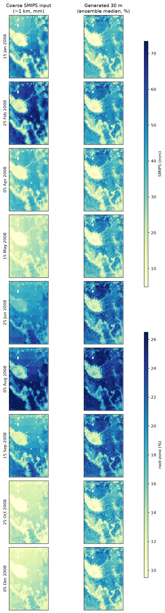

# Downscaling SMIPS soil moisture to 30 m

Statistically downscale the TERN **SMIPS** `TotalBucket` profile soil-water
product (mm, ≈1 km, daily) to a **30 m** daily estimate of root-zone soil
moisture. A gradient-boosting model learns how fine-scale terrain, soil and recent
weather redistribute moisture within each ≈1 km SMIPS cell, trained against the
**OzNet** in-situ network and applied at the 30 m resolution of the Copernicus DEM.

The intended end product is **national (all of Australia)** — every covariate is
Australia-wide, so the method runs anywhere; the work to date develops and
validates it in the Murrumbidgee catchment.

> 📖 **Full methodology, experiments and results:** [`handout/README.md`](handout/README.md)
> — a self-contained, prev/next-linked walkthrough of the whole pipeline and every
> model. This page is setup + implementation.



<sup>Kyeamba Creek through 2008: the ≈1 km SMIPS product as delivered (left)
and the 30 m field generated over the same ground on the same day (right,
ensemble median of model6, model8, model9 and nn-hybrid). Shared colour scale
down each column, so the seasonal cycle — driest in January and late spring,
wettest in the austral winter — is comparable across dates.</sup>

## Setup

EMT runs inside the **PaddockTS** environment and imports PaddockTS directly for
all SMIPS / terrain / soil / weather downloads. Clone both repos side by side:

```bash
git clone git@github.com:thestochasticman/DownscalingMoistureModel.git
git clone git@github.com:thestochasticman/paddock-ts-local.git
```

Use the `paddockts` conda environment (numpy/pandas/xarray/rioxarray/rasterio/…),
then install PaddockTS and this package editable into it:

```bash
conda activate paddockts
pip install -e ./paddock-ts-local        # provides the data-access stack
pip install -e ./DownscalingMoistureModel  # this repo (adds scikit-learn, xlrd)
```

**Credentials** — two free accounts, placed in `~/.config/PaddockTS.json` as
PaddockTS documents:

| Covariate | Source | Needs |
|---|---|---|
| SMIPS + its lookback | TERN GeoServer WCS | nothing (public) |
| Soil (SLGA) | TERN | a TERN API key |
| Antecedent weather | SILO / DataDrill | an email address |
| 30 m terrain | Copernicus DEM (public AWS bucket) | nothing (read anonymously) |

Data is cached under `data/` (gitignored; override with `EMT_DATA_DIR`).

## Quick start — make a 30 m map

Three fitted models ship in the repo, and none of them needs retraining. The
two that need **no SMIPS** run forward from a spin-up to *any* date:

```bash
# the differentiable bucket (nn-hybrid) -- best single-model blocked transfer
PYTHONPATH=. python -m emt.nn.spatial \
    --bbox 147.30 -35.52 147.62 -35.10 --date 2008-08-05 -o field.tif

# the process model (model8) -- point series or 30 m map
PYTHONPATH=. python -m emt.model8.predict --lat -35.05 --lon 147.5 \
    --start 2025-06-01 --end 2025-06-10                       # daily series
PYTHONPATH=. python -m emt.model8.predict \
    --bbox 147.30 -35.52 147.62 -35.10 --date 2024-09-15      # 30 m map
```

The ML-track tool downscales the SMIPS product instead, so it needs SMIPS for
the day plus a year of lookback:

```bash
PYTHONPATH=. python -m emt.predict \
    --bbox 147.30 -35.52 147.62 -35.10 \
    --date 2008-07-31
# writes soil_moisture_2008-07-31.tif + .png into the AOI's PaddockTS query dir
# (-o PATH writes an extra copy elsewhere; --no-plot skips the PNG)
```

> ⚠️ Its shipped artefact `data/models/model6.joblib` was pickled by an older
> scikit-learn and **fails to load on 1.9.0**
> (`ModuleNotFoundError: No module named '_loss'`). Refit it once from the
> cached feature table — seconds, no downloads — see
> [compatibility](handout/modules/predict.py.md#compatibility-the-shipped-model6joblib-and-newer-scikit-learn).
> The process-model artefacts and the neural checkpoint are unaffected.

`--bbox` is `W S E N` in EPSG:4326. A first run over a new area fetches its
covariates (a few minutes), cached for later days. Which tool suits which job
is tabulated in
[`predict.py.md`](handout/modules/predict.py.md#which-tool-for-which-model);
note the branch's best-scoring configuration is an **ensemble** of these
models, which has no single-call wrapper yet — see
[`plot_downscale_gallery_best.py`](handout/plot_downscale_gallery_best.py) for
how the members are combined.

> ⚠️ The shipped model is trained and validated **only** in the Murrumbidgee
> catchment. Run elsewhere and it still produces a field, but with an uncorrected
> per-site level bias and no out-of-region validation — treat off-catchment output
> as indicative, not calibrated. The tool prints this on every run.

## Implementation

The `emt/` package is the implementation of record. The pipeline runs in three
stages — **build the training table → evaluate/train → apply** — each a thin,
testable module.

```
emt/
  insitu/oznet.py   OzNet in-situ loader — the root-zone (0–90 cm) target
  queries.py        PaddockTS Query builders (per-station windows, focus AOIs)
  smips.py          SMIPS coarse predictor (TERN WCS) + lookback rasters
  covariates.py     30 m Copernicus-DEM terrain (slope, aspect, TWI, HLI, …)
  slga.py           SLGA root-zone soil (clay/sand/AWC/bulk density)
  antecedent.py     SILO trailing-window weather (rain / P−PET / VPD)
  features.py       feature derivation (incl. the SMIPS lookback windows)
  build_dataset.py  assemble one row per station-day → data/*.csv
  evaluation.py     leave-site-out cross-validation + metrics
  model1..model6/   estimator packages (each: FEATURES, build_estimator, fit)
  model7/           process model: calibrated bucket water balance (no ML)
  model8/           the full-stack process model (soil+terrain+aridity offsets,
                    AWC capacity, stratified weights); model8/predict.py runs it
                    for any date (point series or 30 m map), no SMIPS needed
  model9/, model10/ pedotransfer readout; bucket storage as an ML feature
  nn/               the neural-network track (PyTorch): an MLP on model6's
                    features, a Transformer over the SILO forcing window, and
                    the differentiable model7 bucket whose parameters come from
                    the statics; nn/cv.py runs the same validation ladder,
                    nn/spatial.py makes 30 m maps (per-pixel buckets, any date)
  persist.py        fit-once model + out-of-fold prediction caching
  downscale.py      model-agnostic per-pixel application → 30 m field
  predict.py        clone-and-run inference tool (Python function + CLI)
```

**1 · Build the dataset.** `build_dataset.py` joins the OzNet target with every
gridded covariate into one table (`data/train_catchment_plus_m_2006_2010.csv`),
one row per station-day. Station coordinates are deliberately **not** features
(they would let the model memorise station identity).

```bash
PYTHONPATH=. python -m emt.build_dataset
```

**2 · Evaluate / train.** Skill is measured by **leave-site-out** cross-validation
(`evaluation.py`): train on all stations but one, predict the unseen one — the
generalisation that matters, since inference happens at pixels with no sensor. Six
models were developed (`model1`…`model6`), from a Random Forest baseline to the
recommended `model6` (regularised histogram gradient boosting + SMIPS lookback +
soil + antecedent meteorology); A parallel
**process-model track** predicts by simulation instead: `model7` is a
calibrated daily bucket water balance driven by SILO rain/PET (no machine
learning, no SMIPS) and `model8` layers on SLGA soil + terrain + aridity
offsets, AWC bucket capacity and stratified training weights — station-out
NSE +0.41 (parity with model6) and clearly better spatial *transfer*
(blocked NSE +0.32 vs a pre-stack +0.22). `persist.py` caches fits and out-of-fold
predictions so figures rebuild in seconds.

**3 · Apply.** Three paths reach 30 m: `downscale.py` applies a *feature-based*
fit per pixel (wrapped by `predict.py`, which fetches every covariate — needs
SMIPS); `model8/predict.py` runs the bucket forward per ≈5 km forcing cell for
any date; and `nn/spatial.py` gives every 30 m pixel its own bucket, with
`snapshots=` reading many dates out of one simulation
([three ways to make a map](handout/modules/downscale.py.md#three-ways-to-make-a-map)). Every SMIPS/soil/weather feature is
strictly **backward-looking** (as of the prediction day) — no feature can see the
future.

## Results (snapshot)

37 stations, 2006–2010, out-of-fold under two designs: **station-out** (hold
out one station — interpolation beside instrumented sites) and **blocked**
(hold out whole spatially independent districts — the honest test for a
national product).

The last three columns are all from the **blocked** design, so they compare
like with like:

| | station-out NSE | blocked NSE | blocked stations NSE > 0 | blocked blocks NSE > 0 |
|---|---|---|---|---|
| **Ensemble (recommended)** | **+0.48** | **+0.42** | **22 / 37** | **8 / 9** |
| nn-hybrid + SMIPS level anchor | +0.39 | +0.34 | 19 / 37 | 6 / 9 |
| nn-hybrid (differentiable bucket) | +0.35 | +0.35 | 18 / 37 | 7 / 9 |
| nn-transformer (scaled, no SMIPS) | +0.43 | +0.22 | 16 / 37 | 5 / 9 |
| model8 (process, previous best) | +0.41 | +0.32 | 20 / 37 | 7 / 9 |
| model6 (ML track) | +0.38¹ | +0.36 | 15 / 37 | 5 / 9 |

<sup>¹ model6's published station-out figure is the 36-station one; every
other number in the table is the 37-station run on this branch.</sup>

The ensemble is a plain median/mean over the model families — every *trained*
combiner tested lost to equal weighting
([nn-stack](handout/modules/nn_stack.md)).

**What still limits it is level, not dynamics.** Median per-station
correlation is 0.82, but roughly 60 % of per-station mean-squared error is a
constant offset; removing each station's mean — an oracle bound, not
achievable — would take the median per-station NSE to ≈ +0.6 with nearly every
station positive. Level at an unobserved site needs *information* (a satellite
anchor such as ESA CCI), not a better estimator: capacity does not buy it
(scaling the Transformer moved station-out +0.36 → +0.43 and blocked not at
all), and neither does a learned combiner.

These are Murrumbidgee numbers. The full story — every model, the validation
ladder, an evaluation leak that was found and corrected, and the negative
results — is in the [handout](handout/README.md). The neural-network models and
the differentiable bucket have their own **[standalone
handout](handout/nn/README.md)**.


<sup>(a) the recommended ensemble's leave-station-out fit; (b) per-station NSE,
ensemble against model8; (c) blocked per-block NSE from model6 through to the
ensemble — the honest transfer test; (d) what the statics preprocessing was
worth. model6's own results figure is on its
[model page](handout/modules/model6.md).</sup>
