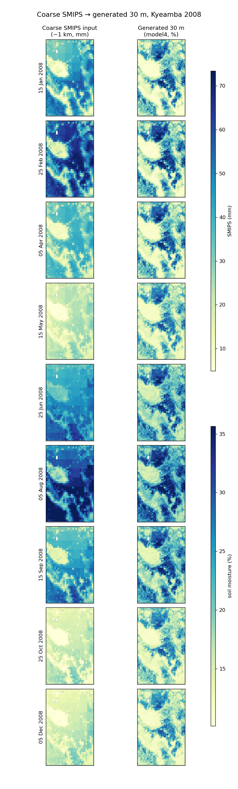
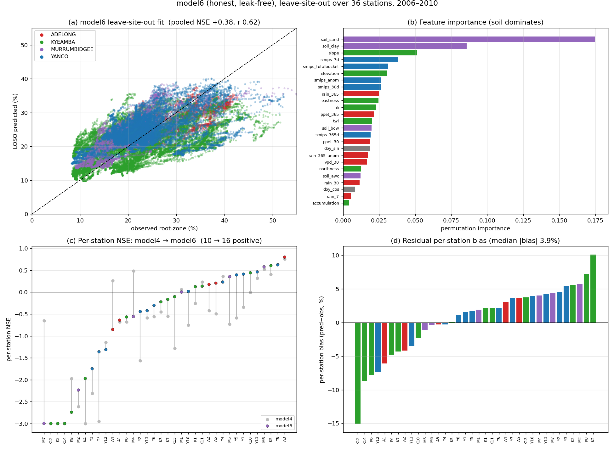

# Downscaling SMIPS soil moisture to 30 m

Statistically downscale the TERN **SMIPS** `TotalBucket` profile soil-water
product (mm, ≈1 km, daily) to a **30 m** daily estimate of root-zone soil
moisture. A gradient-boosting model learns how fine-scale terrain, soil and recent
weather redistribute moisture within each ≈1 km SMIPS cell, trained against the
**OzNet** in-situ network and applied at the 30 m resolution of the Copernicus DEM.

The intended end product is **national (all of Australia)** — every covariate is
Australia-wide, so the method runs anywhere; the work to date develops and
validates it in the Murrumbidgee catchment.

> 📖 **Full methodology, experiments and results:** [`handout/README.md`](handout/README.md)
> — a self-contained, prev/next-linked walkthrough of the whole pipeline and every
> model. This page is setup + implementation.



## Setup

EMT runs inside the **PaddockTS** environment and imports PaddockTS directly for
all SMIPS / terrain / soil / weather downloads. Clone both repos side by side:

```bash
git clone git@github.com:thestochasticman/DownscalingMoistureModel.git
git clone git@github.com:thestochasticman/paddock-ts-local.git
```

Use the `paddockts` conda environment (numpy/pandas/xarray/rioxarray/rasterio/…),
then install PaddockTS and this package editable into it:

```bash
conda activate paddockts
pip install -e ./paddock-ts-local        # provides the data-access stack
pip install -e ./DownscalingMoistureModel  # this repo (adds scikit-learn, xlrd)
```

**Credentials** — two free accounts, placed in `~/.config/PaddockTS.json` as
PaddockTS documents:

| Covariate | Source | Needs |
|---|---|---|
| SMIPS + its lookback | TERN GeoServer WCS | nothing (public) |
| Soil (SLGA) | TERN | a TERN API key |
| Antecedent weather | SILO / DataDrill | an email address |
| 30 m terrain | Copernicus DEM (public AWS bucket) | nothing (read anonymously) |

Data is cached under `data/` (gitignored; override with `EMT_DATA_DIR`).

## Quick start — make a 30 m map

The trained model ships in the repo (`data/models/model6.joblib`), so you can
produce a map for any Australian area and day **without retraining**:

```bash
PYTHONPATH=. python -m emt.predict \
    --bbox 147.30 -35.52 147.62 -35.10 \
    --date 2008-07-31
# writes soil_moisture_2008-07-31.tif + .png into the AOI's PaddockTS query dir
# (-o PATH writes an extra copy elsewhere; --no-plot skips the PNG)
```

or from Python:

```python
from emt.predict import predict
ds = predict(bbox=(147.30, -35.52, 147.62, -35.10), day="2008-07-31")
ds["sm_pred"]                                              # 30 m soil moisture (%)
# (predict() also saves the tif + png into the AOI's query dir; ds.attrs has the paths)
```

`--bbox` is `W S E N` in EPSG:4326. A first run over a new area fetches ~a year of
SMIPS and SILO (a few minutes), cached for later days. See
[`handout/modules/predict.py.md`](handout/modules/predict.py.md) for full details.

> ⚠️ The shipped model is trained and validated **only** in the Murrumbidgee
> catchment. Run elsewhere and it still produces a field, but with an uncorrected
> per-site level bias and no out-of-region validation — treat off-catchment output
> as indicative, not calibrated. The tool prints this on every run.

## Implementation

The `emt/` package is the implementation of record. The pipeline runs in three
stages — **build the training table → evaluate/train → apply** — each a thin,
testable module.

```
emt/
  insitu/oznet.py   OzNet in-situ loader — the root-zone (0–90 cm) target
  queries.py        PaddockTS Query builders (per-station windows, focus AOIs)
  smips.py          SMIPS coarse predictor (TERN WCS) + lookback rasters
  covariates.py     30 m Copernicus-DEM terrain (slope, aspect, TWI, HLI, …)
  slga.py           SLGA root-zone soil (clay/sand/AWC/bulk density)
  antecedent.py     SILO trailing-window weather (rain / P−PET / VPD)
  features.py       feature derivation (incl. the SMIPS lookback windows)
  build_dataset.py  assemble one row per station-day → data/*.csv
  evaluation.py     leave-site-out cross-validation + metrics
  model1..model6/   estimator packages (each: FEATURES, build_estimator, fit)
  persist.py        fit-once model + out-of-fold prediction caching
  downscale.py      model-agnostic per-pixel application → 30 m field
  predict.py        clone-and-run inference tool (Python function + CLI)
```

**1 · Build the dataset.** `build_dataset.py` joins the OzNet target with every
gridded covariate into one table (`data/train_catchment_plus_m_2006_2010.csv`),
one row per station-day. Station coordinates are deliberately **not** features
(they would let the model memorise station identity).

```bash
PYTHONPATH=. python -m emt.build_dataset
```

**2 · Evaluate / train.** Skill is measured by **leave-site-out** cross-validation
(`evaluation.py`): train on all stations but one, predict the unseen one — the
generalisation that matters, since inference happens at pixels with no sensor. Six
models were developed (`model1`…`model6`), from a Random Forest baseline to the
recommended `model6` (regularised histogram gradient boosting + SMIPS lookback +
soil + antecedent meteorology). `persist.py` caches fits and out-of-fold
predictions so figures rebuild in seconds.

**3 · Apply.** `downscale.py` applies a fitted model per 30 m pixel over an AOI
for a day; `predict.py` wraps it into the clone-and-run tool above, fetching every
covariate and loading the shipped model. Every SMIPS/soil/weather feature is
strictly **backward-looking** (as of the prediction day) — no feature can see the
future.

## Results (snapshot)

Recommended model **`model6`**, 36-station leave-site-out, 2006–2010:

| Metric | model6 |
|---|---|
| Pooled NSE / r | **+0.38 / 0.62** |
| Per-station NSE > 0 | 16 / 36 |
| Median per-station \|bias\| | 3.85 % |

The model tracks moisture **dynamics** well (median per-station r 0.81) but carries
a per-station **level** bias (median per-station NSE −0.19) — it is a working
model, **not** a finished product. The full story, including an earlier
evaluation leak that was found and corrected, is in the
[handout](handout/README.md).


