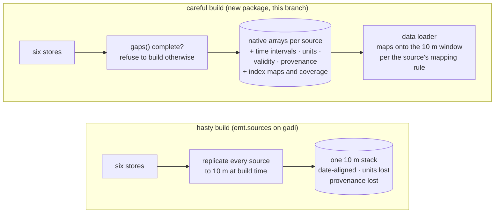

# Combining the data sources carefully

Status: design notes, `data` branch, October 2026. Nothing here is
implemented yet. This page records why the current dataset builder
(`emt.sources` + `emt.regrid`, written in haste on the `gadi` branch to
make one AOI build work) is not careful enough, and what a careful
combination of the six lab stores has to get right before any model is
trained on it.

`emt` itself is a legacy name from an old paper. The source-combination
layer will be a new, properly named package; the model code stays where
it is until it is moved deliberately.

## The sources

Every source comes from a lab store on its own native lattice, filled
once per pixel-day and audited by `gaps()` (see
[troi/docs/ledger.md](https://github.com/thestochasticman/troi/blob/gadi/docs/ledger.md)).
What the stores do *not* record is what a value means in time, which
values are observations, and what units they carry. That is this
layer's job.

| Source | Store | Native lattice | Cadence | What a stamp means | Units | Validity / provenance |
|---|---|---|---|---|---|---|
| SMIPS totalbucket, smindex, bucket1/2, deepD, runoff | pysmips | ~0.01° (0.0099976°) EPSG:4326, 4110 × 3474 | daily from 2005 (2015 for the newer products) | a daily model state; the instant within the day is **to verify** | mm; smindex 0–1 | 404 days (unpublished) read as NaN; `absent/` says why |
| SILO 18 variables | pysilo | 0.05° points, 841 × 681, cell centres at multiples of 0.05° | daily from 1889 | rainfall is the 24 h **to 9 am local** on the stamped date; temperatures are the 24 h to 9 am; **to verify per variable** | mm, °C, MJ/m², hPa | `{var}_source` code per value: station observation vs interpolated vs deaccumulated |
| OzWALD daily Pg, Tmax, Tmin, wind, VP, kT | pyozwald | 0.005° / 0.05° / 0.1° per variable; Pg's extent shifts one row before 2020 | daily | Pg derives from the same 9 am rain-day as SILO/AWAP; **to verify** | mm, °C | no provenance; a year file absent from THREDDS is marked |
| OzWALD 8-day (NDVI, GPP, …) | pyozwald | 0.005° | 46 periods per year from 1 Jan, stamped at period **start**; the last period is 5–6 days | a composite over the period | varies | none |
| SLGA soil attributes | pyslga | ~90 m (1/1200°), per-layer transform | static | the 2014–2021 release per attribute | % for texture, g/cm³, mm/m | nodata from the COG → NaN |
| Copernicus GLO-30 DEM | pycopdem | 1 arc-second | static | — | m | ocean tiles are NaN chunks; TWI is `inf` where slope is 0 |
| Sentinel-2 bands, fmask | pysentinel2 | 10 m EPSG:6933, resampled **once** from DEA's UTM tiles at ingest (odc-stac default, nearest) | irregular, every scene day under the cloud threshold | a solar-day overpass, about 10 am local | scaled int16 reflectance, nodata -999 | fmask per pixel; cloud masking applied on read |

## The challenges

Each of these is a place where the hasty build is either wrong or
silent. They are the specification for the new layer.

### 1. Time semantics differ per source, and the build aligns by date alone

SILO's rain for "2020-03-14" fell between 9 am on the 13th and 9 am on
the 14th. SMIPS's "2020-03-14" is a state the model produced for that
day. Sentinel-2's "2020-03-14" is a 10 am snapshot. OzWALD's 8-day
"2020-03-13" covers the 13th to the 20th. Stacking these on one `time`
coordinate by date treats them as simultaneous. For soil moisture the
cause-and-effect ordering of rain and state is the whole signal, so
this is not a detail: a one-day misalignment is a different physical
relationship.

What careful looks like: every source gets an explicit rule mapping its
stamp to an interval `[t0, t1)` in UTC, the dataset stores those
intervals, and feature construction (antecedent sums, lags) is defined
on intervals, not on stamp equality. The rules are verified against the
upstream documentation, not inferred from the code.

### 2. Cadence is not uniform, and anything that fills the gaps invents data

OzWALD 8-day and Sentinel-2 are sparse in time. The build currently
leaves them at their own cadence (OzWALD) or out entirely (Sentinel-2
is opt-in). The temptation at the next step is to forward-fill or
interpolate onto the daily axis so every day has a value. That turns
an observation into an assumption the model cannot distinguish from
data.

What careful looks like: sparse sources stay sparse, with a validity
mask and, where useful, a "days since last valid observation" field.
How the model consumes sparse observations is a modelling decision,
made explicitly and written in the config, not a side effect of the
data layer.

### 3. Validity is per pixel, and the build drops the provenance that says so

- SILO's `{var}_source` codes distinguish a station measurement from an
  interpolated estimate. The build asks for values only.
- Sentinel-2's fmask marks cloud, shadow, snow and water per pixel. The
  build takes the cleaned reflectance and loses the mask.
- SMIPS unpublished days read as NaN with no distinction from ocean or
  nodata.
- SLGA nodata and ocean DEM chunks are NaN too.

A NaN therefore means five different things. The loss, the sampler and
the evaluation all need to know which.

What careful looks like: every variable carries a validity mask and,
where the source has it, a provenance code, stored beside it under the
same name convention. "Not an observation" is never silently NaN.

### 4. The spatial mapping is exact, but its semantics are not settled

`emt.regrid` maps each 10 m pixel to the native pixel containing its
centre and replicates the value. That is exact and invertible, and the
mass-balance test passes. But:

- Replication is right for a **state** (soil moisture, soil texture)
  and questionable for a **flux or area statistic** (rainfall, NDVI
  composite) where a 10 m pixel near a native cell edge sits under a
  value that is an average over a 5 km cell it only partly shares.
- Native cells only partly inside the AOI are included at full weight.
  `coverage()` computes the fraction; nothing uses it.
- SILO's 0.05° **points** are cell centres at multiples of 0.05°, while
  OzWALD Pg's 0.05° **cells** have edges at multiples of 0.05°. The two
  5 km grids are offset by half a cell. Treating a SILO point as a cell
  is a choice, and it is currently implicit.
- EPSG:6933 is equal-area and EPSG:4326 is not. A native 4326 cell
  covers a different number of 10 m pixels at the north and south of a
  large AOI. Aggregation back to the native pixel is still exact per
  pixel count, but any per-area statistic needs the cell area.

What careful looks like: a per-source mapping rule (state → replicate;
flux → replicate with the coverage fraction recorded; point → declared
cell geometry), stored with the dataset, and the edge pixels of partial
native cells flagged rather than included silently.

### 5. Sentinel-2 has already been resampled once, and nothing downstream knows

DEA serves Sentinel-2 in UTM zones. pysentinel2 puts it on the fixed
EPSG:6933 10 m grid at ingest with odc-stac's default nearest
resampling. That is the one resampling step in the whole chain, it is
unavoidable, and it is the right place for it. But the dataset does not
record it, so a reader comparing a 10 m reflectance pixel to a 10 m
replicated SMIPS pixel has no way to know that only one of them is a
mapped value.

What careful looks like: the dataset records, per variable, its native
CRS and resolution and every resampling step applied, so "how many
times has this value been moved" is answerable from the attrs.

### 6. Units and scaling are not recorded

Reflectance is scaled int16 with nodata -999. SMIPS totalbucket is mm
of profile water and smindex is a 0–1 fraction. SLGA texture is percent
and bulk density is g/cm³. SILO radiation is MJ/m². The stacked zarr
carries none of this. The pedotransfer and bucket models in `emt` apply
unit assumptions in code.

What careful looks like: `units` and `scale_factor`/`add_offset` on
every variable, taken from the upstream documentation, and a single
place where conversions happen.

### 7. Replicating everything to 10 m at build time is the wrong storage shape

A 5 km SILO value is written into 250,000 pixels per day. A 20-year,
50 km AOI at 10 m is 7300 × 5000 × 5000 values per variable. The build
chunks in time to survive, and the result is enormous, slow to read,
and hides each source's own lattice.

What careful looks like: the dataset keeps each source on its native
lattice plus the integer index maps onto the Sentinel-2 window
(`rows[]`, `cols[]`, a few kilobytes) and the coverage fractions. The
data loader replicates on the fly when a model needs the 10 m view.
Regridding then happens where it was always expected to: at training
and prediction time, not at build time.

### 8. Modelling choices are baked in as module constants

`emt.sources` hardcodes one SMIPS product, six SILO variables, five SLGA
attributes at five depths, five terrain derivatives and a 2 km terrain
buffer. Which SLGA depths correspond to the SMIPS bucket depths, whether
the DEM is smoothed before derivatives, and which products are targets
versus features are decisions that change the model.

What careful looks like: a versioned dataset config (one file, checked
in) that names every source, variable, depth, mapping rule and time
rule, and a dataset that records the config it was built from.

### 9. Completeness is auditable but not enforced

Every store answers `gaps()`, and `emt.sources.gaps` runs all six. The
build prints the reports and proceeds anyway. A dataset built from a
store with `never_fetched` units has holes that look like nodata.

What careful looks like: the build refuses unless every report is
complete, and writes the reports into the dataset so "what was absent
upstream on build day" is permanent.

### 10. Known defects in the inputs

- `terrain_twi` is `inf` where slope is zero (pycopdem `derive`).
- OzWALD Pg's file extent moves one row between 2019 and 2020; the
  store handles placement, but any consumer that assumes a fixed
  extent per variable will be wrong.
- SMIPS's two or three most recent days are unpublished at any time;
  a dataset ending "today" always has an absent tail.

## What the new layer must do, in order

1. **Write one specification per source** (time rule, cadence, units,
   validity, provenance, mapping rule, store call) and verify each
   against the upstream documentation listed below.
2. **Gate on completeness**: run the six `gaps()` audits and refuse to
   build on `never_fetched` or `claimed_in_progress`.
3. **Store native, plus maps**: native arrays with full attrs, the
   index maps and coverage onto the Sentinel-2 window, the time
   intervals, the validity masks and provenance codes, the dataset
   config and the gap reports.
4. **Map at read time** through one loader that applies each source's
   mapping rule and refuses to map a value twice.
5. **Then** move the OzNet training-table builder onto it.

## To verify against upstream before writing the specifications

- SILO: per-variable day definition (rainfall to 9 am; others), source
  codes. <https://www.longpaddock.qld.gov.au/silo/about/>
- SMIPS: the model's daily time step and what instant a day's state
  represents, product units and ranges. TERN SMIPS documentation.
- OzWALD: the daily rain-day convention and the 8-day period
  definition, including the final period of the year.
  <https://www.wenfo.org/ozwald/>
- SLGA: units and the depth intervals' relation to the SMIPS bucket
  depths. <https://esoil.io/TERNLandscapes/Public/Pages/SLGA/>
- DEA Sentinel-2: scaling of reflectance, fmask classes, solar-day
  definition. <https://docs.dea.ga.gov.au/>

## Open decisions

- The name of the new package.
- Whether the OzNet training-table builder (`emt.build_dataset`,
  `emt.features`) moves in this redesign or stays on the legacy
  PaddockTS API until the new layer exists.
- Which SLGA depths map to which SMIPS bucket.
- How sparse observations (8-day, Sentinel-2) are presented to the
  model: validity mask only, or mask plus days-since-observation.
- Whether rainfall is treated as a state for mapping purposes (plain
  replication) or as a flux with coverage recorded.

## Related work

A literature survey of comparable efforts (temporal stability and scaling of
sub-pixel soil moisture, downscaling method families, dense-network
validation, learning spatial fields from few labels, and US and European
fine-scale products) is in [related-work.md](related-work.md). Its conclusion
for this design: a few stations can calibrate the amplitude of a fine-scale
pattern but cannot learn its shape, so the pattern must be supplied by a
low-parameter model or an observed carrier and validated against airborne
or dense references, not station error.
