# Statistical downscaling of SMIPS soil moisture to 30 m

## Objective

Produce a 30 m daily estimate of root-zone soil moisture by statistically
downscaling the TERN SMIPS `TotalBucket` profile soil-water product (mm,
≈1 km, daily). A regression model is trained against in-situ observations to
learn how fine-scale terrain redistributes moisture within each ≈1 km SMIPS
cell; the model is then applied at the 30 m resolution of the Copernicus DEM.

This document describes the processing pipeline, two data-quality issues
identified and resolved during development, and the cross-validation and
spatial-transfer results obtained to date. Each pipeline component has a
corresponding note under [`modules/`](modules/); all figures are reproducible
(see [Reproducibility](#reproducibility)).

## Pipeline

| Stage | Module | Output |
|---|---|---|
| 1. Ground truth | [`oznet.py`](modules/oznet.py.md) | Daily root-zone (0–90 cm) soil moisture per OzNet station (the regression target) |
| 2. Study areas | [`queries.py`](modules/queries.py.md) | PaddockTS `Query` extents (per-station windows and focus catchments) |
| 3a. Coarse predictor | [`smips.py`](modules/smips.py.md) | SMIPS `TotalBucket` field (mm), the quantity being downscaled |
| 3b. Fine predictors | [`covariates.py`](modules/covariates.py.md) | 30 m terrain covariates (elevation, slope, northness/eastness, TWI, HLI, flow accumulation) |
| 4. Feature assembly | [`features.py`](modules/features.py.md) | Training table: one record per station-day (target, SMIPS, terrain, seasonality) |
| 5. Model | [`model1`](modules/model1.md) · [`model2`](modules/model2.md) · [`model3`](modules/model3.md) · [`model4`](modules/model4.md) | Random Forest (baseline), a linear comparison, gradient boosting, and the improved climatology+soil model; shared scoring and cross-validation in [`evaluation.py`](modules/evaluation.py.md) |
| 6. Downscaling | [`downscale.py`](modules/downscale.py.md) | Per-pixel application of the model to produce a 30 m field |

## The model

The downscaling model is a **Random Forest regressor**: an ensemble of decision
trees, each fit to a bootstrap sample of the training rows, whose predictions are
averaged. It learns a nonlinear relationship between the coarse SMIPS value and
the fine terrain covariates without a prescribed functional form, and it yields
feature importances. One structural property is relevant to the results: because
each tree's prediction is an average of training samples, the model cannot
extrapolate beyond the training range and tends to shrink predictions toward the
mean (quantified in [Per-station performance](#per-station-performance)).

- **Target (`y`):** OzNet root-zone soil moisture (%).
- **Features (`X`):** the coarse `smips_totalbucket` (mm); seven 30 m terrain
  covariates (elevation, slope, northness, eastness, TWI, HLI, flow
  accumulation); and two seasonality terms (`doy_sin`, `doy_cos`).

```
sm_rootzone_pct  ~  smips_totalbucket + terrain(...) + doy_sin + doy_cos
```

A sample of the training table (one row per station-day; selected feature columns,
with the target in the last column. Northness, eastness and flow accumulation are
omitted here for width):

| station | date | smips (mm) | elev (m) | slope | twi | hli | doy_sin | doy_cos | target (%) |
|---|---|---|---|---|---|---|---|---|---|
| A1 | 2008-08-12 | 100.2 | 828 | 8.74 | 3.48 | 0.99 | −0.67 | −0.75 | **41.7** |
| A5 | 2008-03-23 | 35.2 | 377 | 0.21 | 9.80 | 0.84 | 0.99 | 0.14 | **20.3** |
| K12 | 2008-09-01 | 51.0 | 217 | 0.22 | 7.52 | 0.84 | −0.88 | −0.48 | **46.0** |
| K11 | 2008-12-11 | 1.9 | 322 | 7.13 | 4.02 | 0.84 | −0.33 | 0.95 | **8.5** |
| Y13 | 2008-01-20 | 95.7 | 123 | 0.48 | 4.78 | 0.85 | 0.34 | 0.94 | **40.0** |
| Y3 | 2008-03-22 | 15.0 | 145 | 2.37 | 6.95 | 0.89 | 0.99 | 0.16 | **8.7** |

These rows show the relationship the model exploits (wetter SMIPS generally pairs
with a higher target) and the spread it must resolve within it.

Station coordinates (`lat`/`lon`) are excluded so the model cannot encode station
identity; `station` is retained only as the grouping variable for spatial
cross-validation. The same fitted model is used two ways: evaluated by
leave-site-out cross-validation, and applied to every 30 m pixel of an area to
produce the downscaled field. Reported skill is always the held-out estimate,
never an in-sample fit. Configuration (`build_estimator`): 300 trees, minimum 3
samples per leaf; see [`model1`](modules/model1.md). An alternative linear model
([`model2`](modules/model2.md)) is compared in
[Model comparison](#model-comparison).

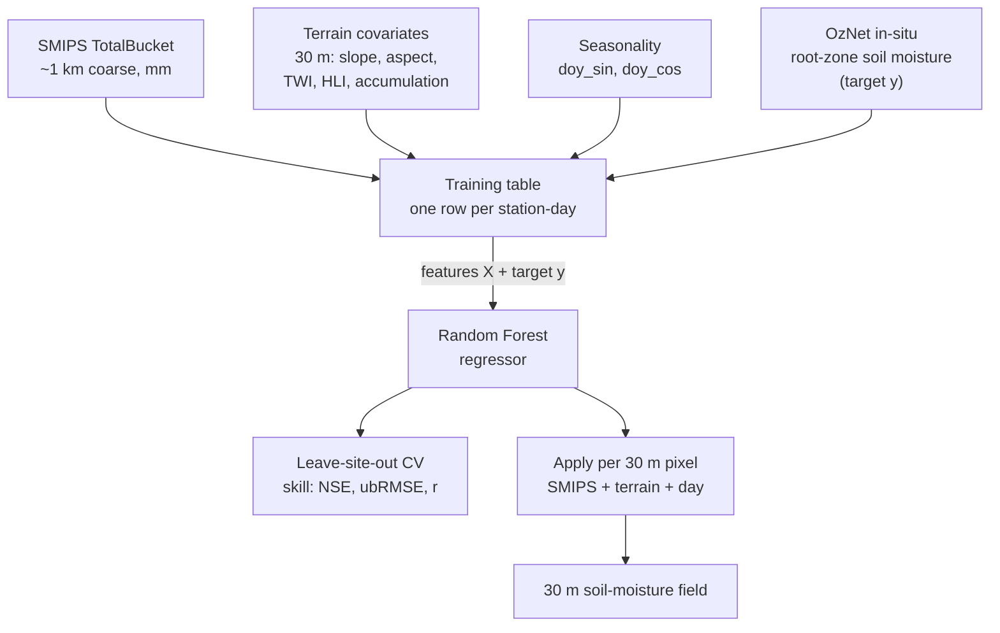

The predictors and the in-situ target are assembled into one table; the Random
Forest is fit on it, then either cross-validated or applied pixel-by-pixel to
produce the 30 m map.

## Evaluation

Reported skill is always a **held-out** estimate, produced by **leave-one-site-out
(LOSO) cross-validation** — a *spatial* split in which the hold-out unit is a
whole **station**, not a random subset of rows and not a time span. Grouping on
the `station` column with scikit-learn's `LeaveOneGroupOut`, the procedure runs
one fold per station:

- **the held-out unit is one station** — all of its station-day rows form the
  test set;
- **the training set is every other station** — all rows from the remaining
  stations;
- a fresh model is fit each fold, so no fitted state leaks between folds.

After all folds every row has a prediction from a model that **never saw that
station**. Holding out a whole station tests exactly the intended use — predicting
an unobserved location — whereas a random row split would leak each station's own
level into training and inflate apparent skill. Station coordinates (`lat`/`lon`)
are excluded from the features for the same reason; `station` is used only as the
grouping variable.

The out-of-fold predictions are scored two ways, and both are reported:

- **Pooled** — over all station-days at once. Because observed values span dry
  (Yanco) to wet (Adelong) sites, the between-site variance enters the NSE
  denominator, making the pooled figure comparatively lenient.
- **Per-station** — within each station's own series. This removes the between-site
  spread and is the more exacting temporal test; it is the figure to weight.

The two differ substantially here (pooled NSE +0.15 vs per-station NSE negative at
23/30 stations), and that gap is the central result: the model reproduces
*dynamics* but carries a per-station absolute-level *bias*
(see [Per-station performance](#per-station-performance)). One caveat: the split
is purely spatial — there is no temporal hold-out, so LOSO measures spatial
transfer, not forecasting into unseen time. The full procedure, return values,
and metric definitions are documented in
[`evaluation.py`](modules/evaluation.py.md); metric formulae are also tabulated
under [Metrics](#metrics).

## Data quality: SMIPS WCS grid resampling

SMIPS is published on a fixed *native grid*: ≈1 km cells at fixed geographic
positions (origin 112.90499°E, −43.73500°N; cell size 0.0099976°, from the WCS
`DescribeCoverage`). The TERN GeoServer Web Coverage Service does not return that
grid directly; it fits an integer number of pixels into whatever bounding box is
requested, so the returned cell size and origin shift with the request. A fixed
point can therefore fall in different ≈1 km cells depending on the window: for
station K6 the sampled value was 43.7, 49.6, or 61.6 mm across three windows for
the same location and date (a ≈40 % range).

The fix (`snap_bbox` in [`smips.py`](modules/smips.py.md)) rounds each request
out to the native grid lines, so the server's integer-pixel fit reproduces the
native grid and sampling becomes independent of the request window. (The
`scaleFactor=1` parameter was tested and has no effect.)

The mechanism and its resolution are shown below for station K6 on one day, using
three request windows of different sizes centred on the station.

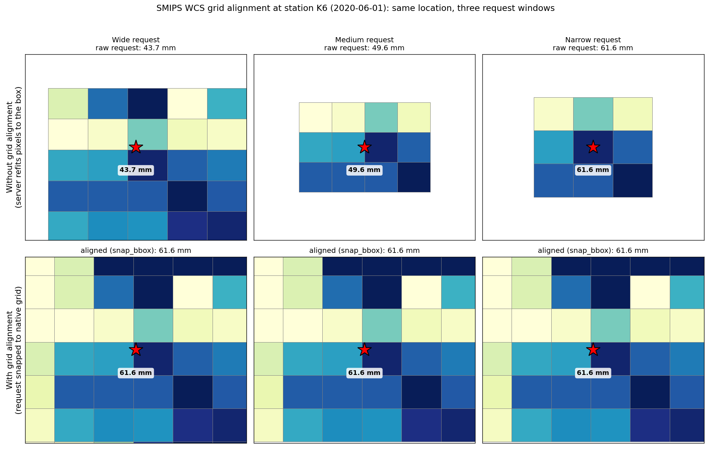

Top row (without alignment): the service returns a different pixel grid for each
request window, so the cell boundaries shift between panels and the station (red
star) falls in a different ≈1 km cell each time, yielding 43.7, 49.6, and 61.6 mm
for the same location and date. Bottom row (with `snap_bbox`): each request is
aligned to the native grid, the returned cells coincide across all three windows,
and the station returns 61.6 mm in every case. This figure is reproduced from
live SMIPS by [`plot_grid_alignment.py`](plot_grid_alignment.py). The next figure
shows the effect of this correction on the training data.

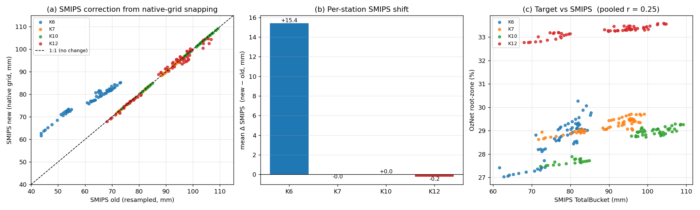

In this figure and those that follow, each colour denotes one of the four
Kyeamba stations (K6, K7, K10, K12) and a point is one station-day.

- **(a)** SMIPS values before (x) versus after (y) the correction; the dashed
  line marks no change. Three stations lie on the line (their original request
  windows already resolved to the correct cell); K6 lies above it, indicating its
  values changed.
- **(b)** Mean per-station change: K6 +15.4 mm, the others ≈0. The resampling
  issue materially affected one of the four stations.
- **(c)** Corrected SMIPS (x) against the observed target (y). The four stations
  occupy near-horizontal bands (K12 ≈33 %, the others ≈29 %): SMIPS varies within
  a station but provides little separation between the stations' mean moisture
  levels. The weak pooled correlation (r = 0.25) reflects this and is relevant to
  the next section.

Cached SMIPS extracted before this correction used window-dependent values; the
training table and model were rebuilt after clearing the cache.

## Initial evaluation: single-cluster training set

The model was first evaluated on four Kyeamba stations (June–July 2020) using
**leave-site-out cross-validation**: the model is trained on three stations and
evaluated on the fourth, which it has not seen, with the procedure repeated for
each station in turn. This estimates performance at a new location, which is the
intended application. The result was negative pooled skill (r = −0.45,
NSE = −1.16), with negligible SMIPS feature importance (0.006). The figures below
explain why.

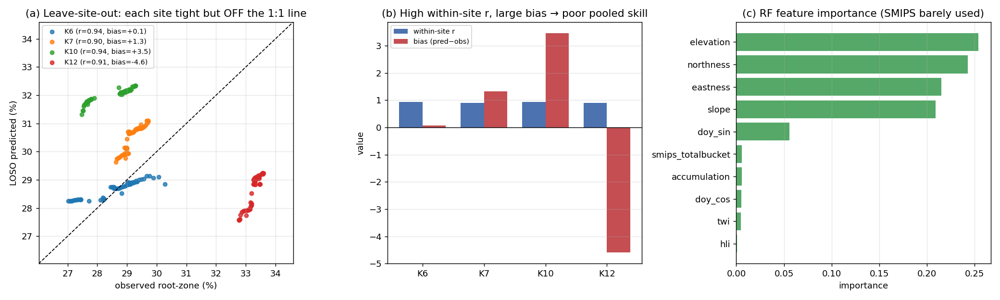

- **(a)** Predicted (y) versus observed (x) for each held-out station; the dashed
  line marks perfect prediction. Each station forms a tight cluster (the
  day-to-day variation is reproduced) but the clusters sit off the line. K12
  (observed ≈33 %, predicted ≈28 %) is the clearest case: the temporal pattern is
  correct but the absolute level is not.
- **(b)** Per station, the correlation (blue) is ≈0.9 throughout while the bias
  (red) is large (K10 +3.5, K12 −4.6). High correlation combined with large bias
  produces the negative pooled NSE.
- **(c)** Feature importance is dominated by terrain (≈88 %); `smips_totalbucket`
  is near the bottom (≈0.006). For a method intended to downscale SMIPS, this
  indicates SMIPS is not contributing.

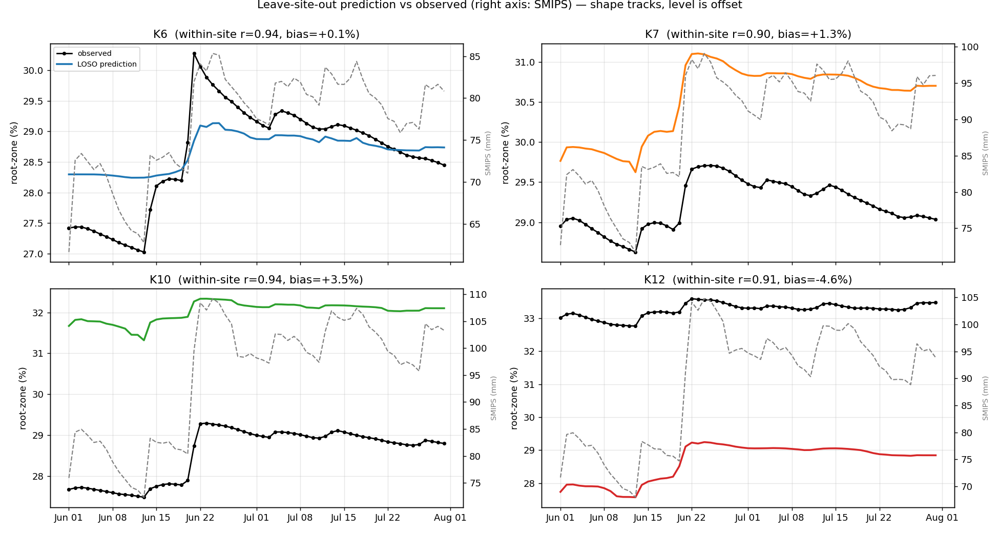

The per-station time series (black: observed; colour: held-out prediction; grey
dashed: SMIPS on the right axis) show the same outcome: the prediction follows
the shape of the observations but sits at an offset level.

**Assessment.** The four stations lie within approximately one SMIPS cell, so the
coarse predictor takes nearly the same value at all four and carries no
between-station signal. With no basis for distinguishing the stations, the model
relies on terrain and cannot determine the absolute level of a held-out station.
This is a limitation of training-set spatial coverage rather than of the
pipeline, and motivates expansion to multiple catchments.

## Expanded training set: Yanco, Kyeamba, Adelong (2006–2010)

The training table was rebuilt across the three clustered catchments
(30 stations, 40,590 station-days). SMIPS was retrieved as three site-level
cubes via cluster-fetch ([`features.py`](modules/features.py.md)). The sites are
separated by 100–150 km, providing between-site variation in the coarse
predictor.

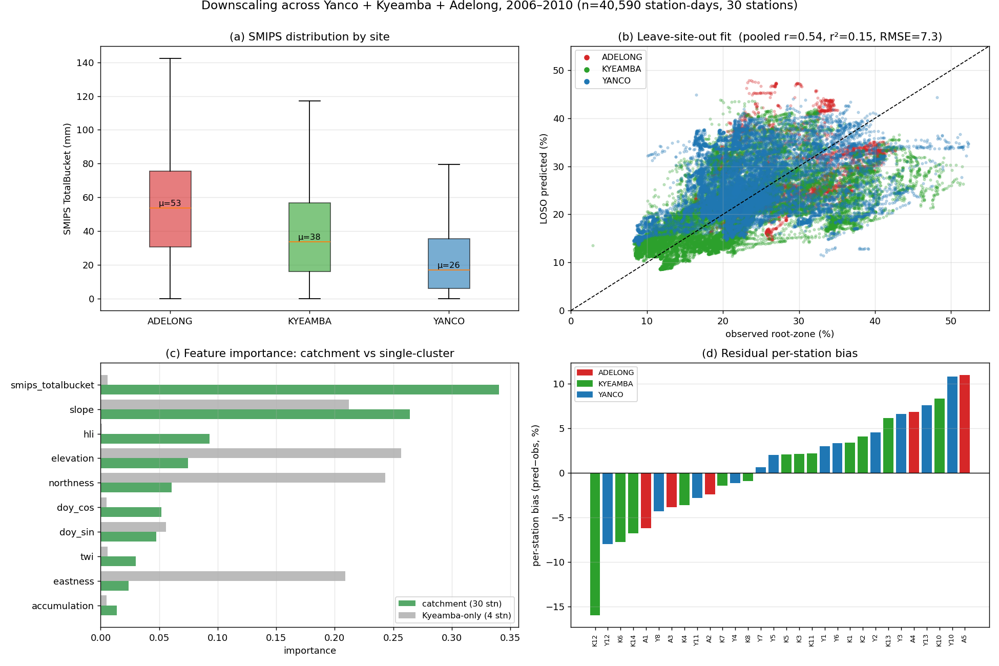

- **(a)** Site-level SMIPS distributions differ (Adelong ≈53, Kyeamba ≈38,
  Yanco ≈26 mm), supplying the between-site signal absent in the single-cluster
  set.
- **(b)** Leave-site-out fit across 30 held-out stations: pooled r = 0.54,
  NSE = +0.15.
- **(c)** Feature importance: SMIPS becomes the highest-ranked predictor (0.34),
  followed by slope (0.27).
- **(d)** Residual per-station bias persists (e.g. K12 −16 %, A5 +11 %).
  Per-station ubRMSE remains low (≈3–4 %), indicating that temporal dynamics are
  well reproduced and the residual is a level offset.

| Metric | Kyeamba only (4 stations) | Catchment (30 stations) |
|---|---|---|
| Pooled leave-site-out r | −0.45 | +0.54 |
| Pooled leave-site-out NSE | −1.16 | +0.15 |
| SMIPS feature importance | 0.006 | 0.34 |
| corr(target, SMIPS) | 0.25 | 0.53 |

Between-site variation in SMIPS changes its feature importance from negligible to
dominant and raises the pooled NSE from −1.16 to +0.15. The pooled figure should
be read alongside the per-station results below, which are more demanding.

### Per-station performance

The pooled NSE is computed over all station-days together. Because the observed
values span dry (Yanco) to wet (Adelong) sites, the between-site variance enters
the denominator and makes the pooled figure relatively lenient. The standard
per-station (temporal) NSE, computed on each station's own series, is the more
exacting test.

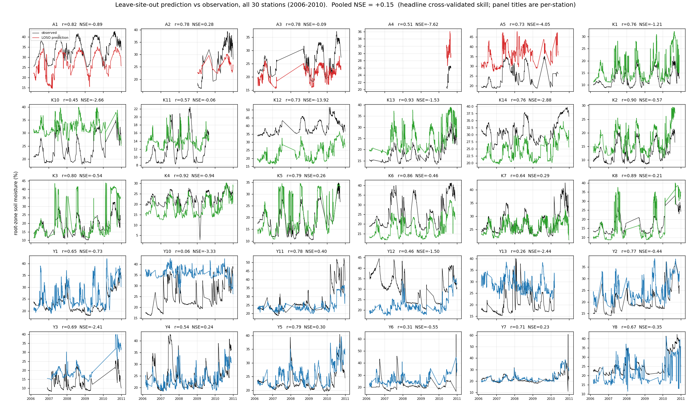

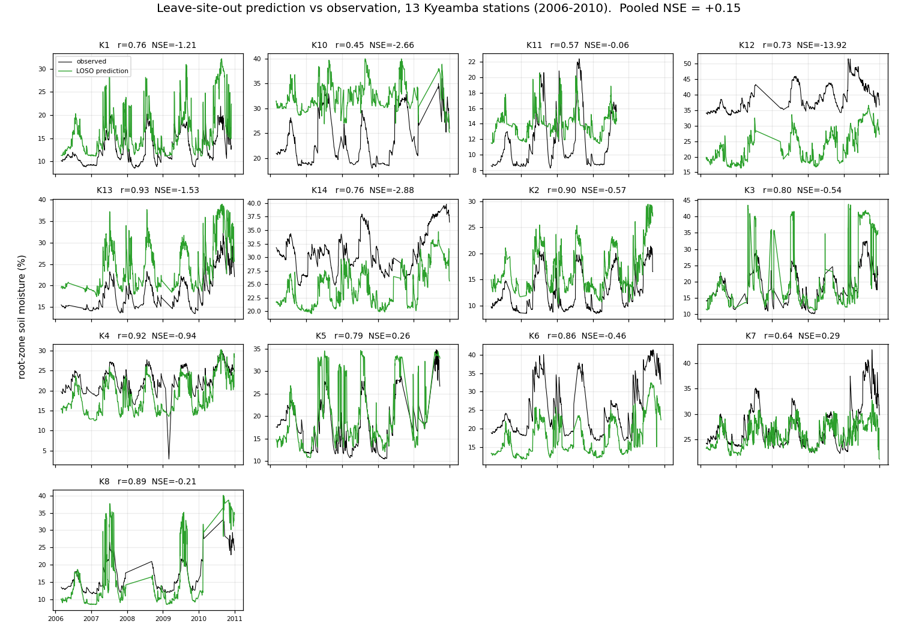

Across the 30 held-out stations the model reproduces temporal dynamics well
(median per-station r = 0.75, median ubRMSE = 3.9 %): in each panel the
prediction follows the shape of the observations. However, **per-station NSE is
negative at 23 of 30 stations (median −0.56)** because the absolute-level bias
dominates the per-station statistic. By the standard per-station definition the
model does not yet reach NSE > 0 at most sites; the positive pooled value
(+0.15) reflects the easier between-site comparison.

#### The bias is shrinkage toward the training mean

The per-station bias is a systematic *shrinkage* effect: a Random Forest predicts
by averaging training samples and cannot extrapolate, so it compresses
predictions toward the central tendency.

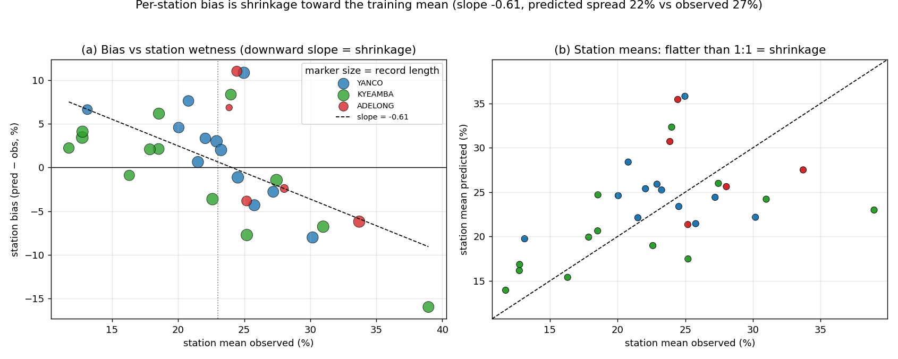

- **(a)** Per-station bias is negatively correlated with station wetness
  (r = −0.62, slope −0.61): dry stations are over-predicted, wet stations
  under-predicted. The model removes roughly 60 % of each station's departure
  from the global mean.
- **(b)** Predicted station means span a narrower range than observed (22 % vs
  27 %), flatter than the 1:1 line.

Two effects contribute. The dominant one is *limited identifiability*: SMIPS and
terrain explain only ~40 % of the between-station level differences, so the
unexplained baseline collapses to the mean. A minor secondary effect is
*sampling imbalance* (bias correlates weakly with record length, r = −0.22),
addressable by sample weighting.

A natural hypothesis was that the missing baseline is soil, and that an SLGA soil
covariate would supply it. This was tested and **did not hold**; see
[Soil covariate experiment](#soil-covariate-experiment-negative-result). The
remaining levers are listed under [Future work](#future-work).

## 30 m downscaling and spatial transfer

Stage 6 applies the model per pixel to produce the 30 m field
([`downscale.py`](modules/downscale.py.md)). To obtain an out-of-sample
assessment, the model was trained on Kyeamba and Adelong only, with Yanco
withheld entirely; the resulting field and its validation therefore represent
transfer to an unobserved catchment. Evaluation date: 2008-07-31 (all 12 Yanco
stations reporting).

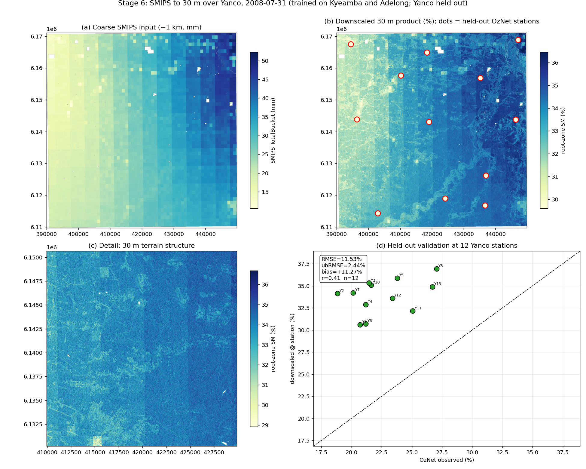

- **(a)–(c)** The ≈1 km SMIPS input is resolved to a 30 m field; the detail view
  (c) shows drainage-network structure not present in the coarse input.
- **(d)** Validation at the 12 withheld Yanco stations:

  | Metric | Value | Interpretation |
  |---|---|---|
  | RMSE | 11.5 % | Dominated by bias |
  | ubRMSE | 2.4 % | Bias-removed error is low; spatial pattern transfers |
  | Bias | +11.3 % | Systematic over-prediction of the semi-arid Yanco plains by a model trained on wetter upland sites |
  | r | 0.41 | Moderate, across 12 stations |
  | NSE | −20 | Strongly negative because this is a single date: the between-station spread is small, so the +11.3 % bias dominates the statistic. NSE is informative over the full record (the leave-site-out value above), not for a one-day spatial snapshot. |

**Assessment.** Under full-region transfer the relative spatial structure is
reproduced (ubRMSE 2.4 %) while the absolute level carries a substantial regional
bias. This is consistent with the residual per-station bias observed in Stage 5:
SMIPS and terrain do not encode the local soil and climate properties that set
the absolute moisture level. See [Limitations](#limitations) and
[Future work](#future-work).

### The same demonstration with model4

Rerunning the identical protocol with [`model4`](modules/model4.md)
([`plot_downscale_model4.py`](plot_downscale_model4.py); the AOI's SMIPS
climatology and SLGA soil rasters are supplied via ``downscale(...,
extra_layers=...)``):

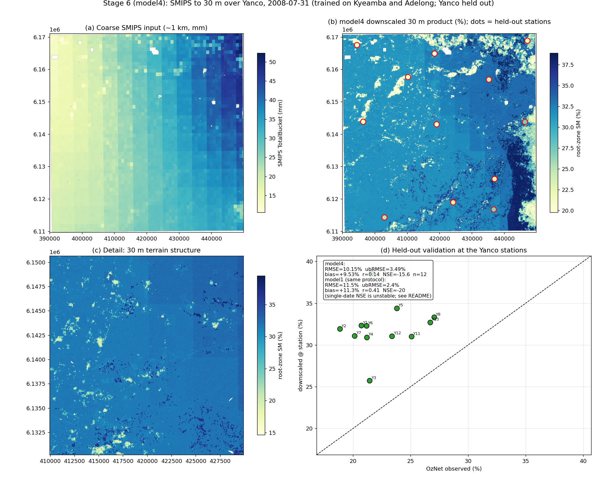

| Metric (single date, 12 stations) | model1 | model4 |
|---|---|---|
| RMSE | 11.5 % | **10.3 %** |
| Bias | +11.3 % | **+9.0 %** |
| ubRMSE | **2.4 %** | 4.9 % |
| r | **0.41** | 0.30 |

A mixed, instructive result. The regional *level* improves (bias −2.3 points),
consistent with the leave-region-out evaluation over the full record (Yanco NSE
−1.81 → −0.44, bias +9.2 → +6.1). But the *single-day spatial pattern* is worse:
the model4 field visibly inherits blocky SLGA map-unit boundaries (panel b) and
mutes the dendritic terrain detail of the model1 map, because the added static
features (climatology, soil) now carry weight that terrain carried alone in
model1. One station (Y3) is thrown low by a soil boundary. Two readings follow:
first, the single-date snapshot remains a poor summary of skill (the full-record
leave-region-out is the meaningful transfer number); second, the soil covariate
buys per-station calibration at some cost in fine-scale spatial texture — a
tradeoff to revisit when more sites allow soil's weight to be estimated more
robustly (or with smoothed soil rasters).

## Metrics

| Metric | Definition |
|---|---|
| RMSE | Root-mean-square error, √mean((pred − obs)²) |
| ubRMSE | Bias-removed RMSE, √(RMSE² − bias²); the standard soil-moisture skill statistic |
| Bias | mean(pred − obs) |
| r | Pearson correlation |
| NSE | Nash-Sutcliffe efficiency, 1 − Σ(pred − obs)² / Σ(obs − mean obs)². NSE = 1 is perfect, NSE > 0 is more skilful than the observed mean, NSE < 0 is worse. Identical to the coefficient of determination (returned as `r2` in code). |

Generalisation skill is reported as the leave-site-out or leave-region-out value
in all cases. NSE > 0 (skill beyond the observed mean) is the conventional
threshold for a useful soil-moisture model. NSE can be computed *pooled* (over
all station-days) or *per-station* (each station's own series); the two differ
substantially here and both are reported. The per-station figure is the more
exacting and is the one to weight. The cross-validation procedure that produces
these held-out predictions — leave-one-site-out, grouped by station — is
documented in [`evaluation.py`](modules/evaluation.py.md).

## Interpreting the result

The outcome is best read as a validated proof of concept rather than a finished
product. The pipeline works end to end and SMIPS is the dominant predictor; the
limiting factor throughout is absolute-level bias, not dynamics. The sections
above trace how that bias was diagnosed and then substantially reduced:

- **Dynamics were reproduced well from the start.** Across the 30 held-out
  stations, median per-station correlation 0.75–0.80 and ubRMSE ≈3.5–3.9 % for
  every model tested. The models follow the shape of each station's series.
- **The baseline model (model1) did not clear per-station NSE > 0** (median
  −0.56, positive at 7/30): a per-station level bias dominated the statistic,
  while the lenient pooled figure (+0.15) hid it. This diagnosis — level, not
  dynamics — drove everything after.
- **model4 closes most of that gap** (median per-station NSE −0.07, 14/30
  positive, pooled +0.35) by giving the model a legitimate level signal (SMIPS
  pixel climatology) plus soil, under a heavily regularised estimator
  ([The improvement search](#the-improvement-search-model4)). Half the stations
  now clear the NSE > 0 threshold; the median sits at it.
- **Cross-region transfer improved from failing to marginal.** Under
  leave-region-out, model1 scored −0.72 (Yanco bias +9.2 %); model4 scores
  +0.12 with all regional biases smaller. Application to a climatically
  different region still warrants bias correction, but the failure mode is no
  longer categorical.

The oracle diagnostic (NSE 0.83 with true station means) shows the remaining
deficit is still almost entirely the site-level baseline — the lever is more
training sites (see [Future work](#future-work)). When evaluating a new dataset,
weight the per-station NSE over the full record, not a single-date spatial
snapshot (for which NSE is unstable when the between-station spread is small).

## Soil covariate experiment (negative result)

The per-station bias was hypothesised to be missing soil information: stations
with similar SMIPS and terrain but different true baselines should be separable
by soil texture and water-holding capacity. SLGA v2 soil covariates
([`slga.py`](modules/slga.py.md): clay, sand, available water capacity, bulk
density, depth-averaged 0–100 cm) were added and evaluated by leave-site-out
cross-validation on the same table.

| Configuration | pooled NSE | r | per-station NSE > 0 |
|---|---|---|---|
| **No soil (baseline)** | **+0.15** | **0.53** | 7/30 |
| All 4 soil, point-sampled | +0.03 | 0.47 | 12/30 |
| AWC only, point-sampled | +0.12 | 0.51 | 7/30 |
| AWC only, ~1 km mean | +0.12 | 0.51 | 9/30 |
| All 4 soil, ~1 km mean | −0.27 | 0.28 | 15/30 |

**Soil did not improve generalisation; no configuration beat the no-soil
baseline.** The full soil set made `soil_sand` the second most important feature,
but it functions as a near-unique per-station identifier, the same leakage that
`lat`/`lon` are excluded to avoid, so it fits the training stations and
mis-calibrates held-out ones. The pattern is clearest in the last row: the ~1 km
soil set produced the *best* per-station NSE (15/30 positive) yet the *worst*
pooled skill (−0.27), i.e. it fitted each station locally while scrambling the
cross-site ranking that a spatial product requires.

The conclusion at the time was that the residual bias is not a missing soil
feature but **too few training sites** for any site-level covariate to
generalise. The loader ([`slga.py`](modules/slga.py.md)) was retained.

**Postscript (model4): the negative result was conditional, not absolute.** Once
the SMIPS pixel climatology supplies a legitimate level anchor
([The improvement search](#the-improvement-search-model4)), the same four soil
covariates *add* skill and give the best per-station profile. Without an anchor
the model pressed soil into service as a station identifier (the leakage
described above); with one, soil contributes genuine texture signal. Soil is a
feature of [`model4`](modules/model4.md).

## Model comparison

The estimator is isolated in per-model packages ([`emt/model1`](modules/model1.md),
[`emt/model2`](modules/model2.md), [`emt/model3`](modules/model3.md)) that share
the data, features, and scoring harness
([`evaluation.py`](modules/evaluation.py.md)), so approaches are compared
directly. Results to date:

| Model | Estimator | cross-site (pooled NSE, r) | per-station NSE > 0 |
|---|---|---|---|
| [**model4**](modules/model4.md) | Regularised HistGB + climatology + soil | **+0.35, 0.62** | **14/30** |
| [model1](modules/model1.md) | Random Forest | +0.15, 0.53 | 7/30 |
| [model3](modules/model3.md) | Gradient boosting (HistGB, stock) | +0.12, 0.47 | 8/30 |
| [model2](modules/model2.md) | Linear (Ridge, scaled) | +0.02, 0.36 | 12/30 |
| Huber (robust linear) | tested only | −0.02, 0.34 | 15/30 |
| [model5](modules/model5.md) | model4 + smoothed soil (tradeoff, not recommended) | +0.13, 0.50 | 12/30 |

Among models 1–3 the results traced a **cross-site ↔ per-station tradeoff**:
every configuration that put more stations at positive per-station NSE gave up
cross-site skill, and vice versa. `model1` (Random Forest) took the cross-site
end (+0.15, but a black box); `model2` (linear) the per-station end (12/30, with
interpretable, physically-signed coefficients — slope negative, SMIPS positive);
`model3` (stock gradient boosting) landed between (+0.12, best per-station
ubRMSE 3.5 %). Strengthening the linear model did not help (penalty tuning was a
no-op; polynomial features exploded out of sample), and stock boosting could not
overtake the forest — which suggested the ceiling was set by too few sites, not
the estimator.

**[`model4`](modules/model4.md) broke that tradeoff** — better on *both* axes at
once (pooled NSE +0.35 **and** 14/30 per-station, median per-station NSE −0.56 →
−0.07). The tradeoff was therefore not a law of the problem but a symptom of a
**missing feature**: none of the earlier models had a legitimate way to set a
location's absolute moisture level, so they could only trade level errors
between the pooled and per-station views. See the next section.

## The improvement search: model4

A systematic search (features from existing data, new covariate sources,
estimator settings, sample weighting, ensembling, problem restructuring — all
scored by the same leave-site-out harness) produced
[`model4`](modules/model4.md), which more than doubles cross-site skill while
also improving the per-station profile:

| Metric (30 stations, 2006–2010) | model1 | model4 |
|---|---|---|
| Pooled LOSO NSE / r | +0.15 / 0.53 | **+0.35 / 0.62** |
| Per-station NSE > 0 | 7/30 | **14/30** |
| Median per-station NSE | −0.56 | **−0.07** |
| Leave-region-out NSE | −0.72 | **+0.12** |

Three ingredients, each independently validated (full detail in the
[module note](modules/model4.md)):

1. **SMIPS pixel climatology** — the pixel's long-term SMIPS mean/std plus the
   day's anomaly/z-score. This factors the coarse predictor into a static
   *level* and a dynamic *departure*, supplying the missing local-baseline
   signal. Because it derives from SMIPS alone it is available at every pixel at
   inference and cannot memorise stations. Largest single lever (+0.08 pooled
   NSE on every estimator tested).
2. **Extreme boosting regularisation** — skill rises monotonically as trees
   shrink, peaking at `max_leaf_nodes=3` (seed-stable). Tiny trees cannot
   memorise site quirks.
3. **Soil, rehabilitated** — with the climatology anchoring the level, the SLGA
   covariates add skill instead of acting as station IDs (see the re-reading of
   the [soil experiment](#soil-covariate-experiment-negative-result) below).

Ideas tested that did **not** survive: SILO climate dynamics (+0.02 alone, ~0
with soil), SMIPS temporal lags, aridity statics, equal-station weighting,
two-stage decomposition, RF+HGB ensembling (pooled tie, worse per-station).

The same leave-site-out diagnostics shown for model1 earlier, recomputed for
model4:

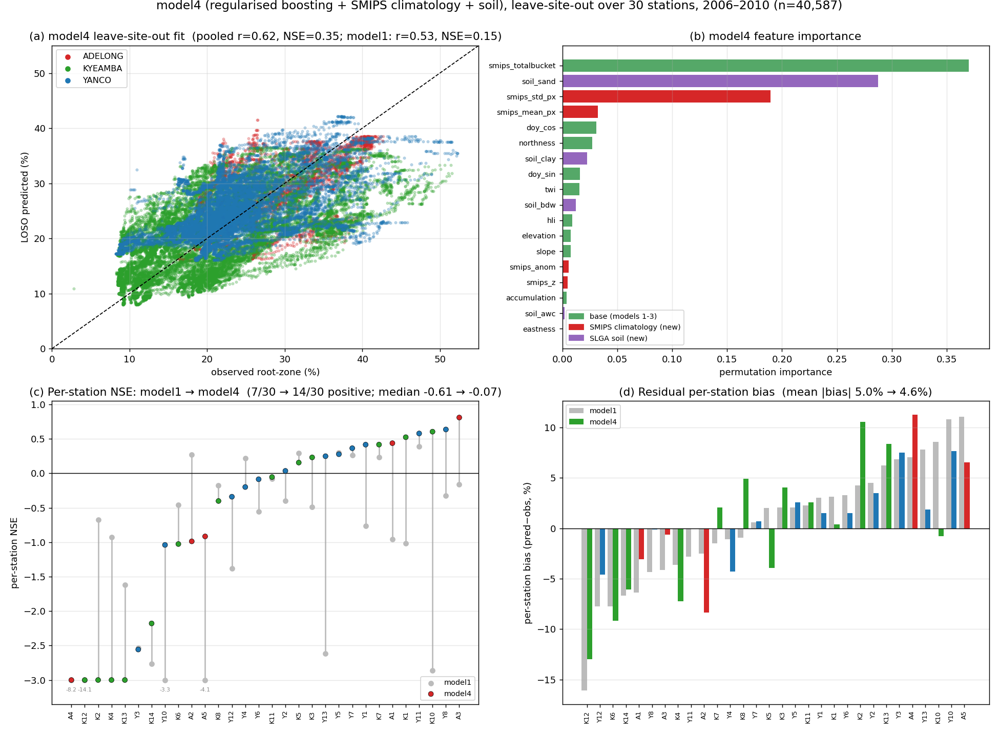

- **(a)** Leave-site-out fit: pooled r 0.62, NSE +0.35 (model1: 0.53 / +0.15).
- **(b)** Permutation feature importance, with the new feature groups coloured.
  `smips_totalbucket` stays the top predictor, but `soil_sand` and the SMIPS
  climatology terms (`smips_std_px`, `smips_mean_px`) are the 2nd–4th — the
  added level information the earlier models lacked.
- **(c)** Per-station NSE, model1 → model4 (grey → coloured): 25 of 30 stations
  improve, the count positive rises 7 → 14, and the median moves from −0.61 to
  −0.07. This is the panel that shows the tradeoff breaking — the gains are
  broad, not a few sites traded for others.
- **(d)** Residual per-station bias shrinks at most stations (mean |bias|
  5.0 % → 4.6 %), though a few sites (e.g. K2) worsen.

The per-station held-out time series (the temporal view, as shown for model1)
for all 30 stations:

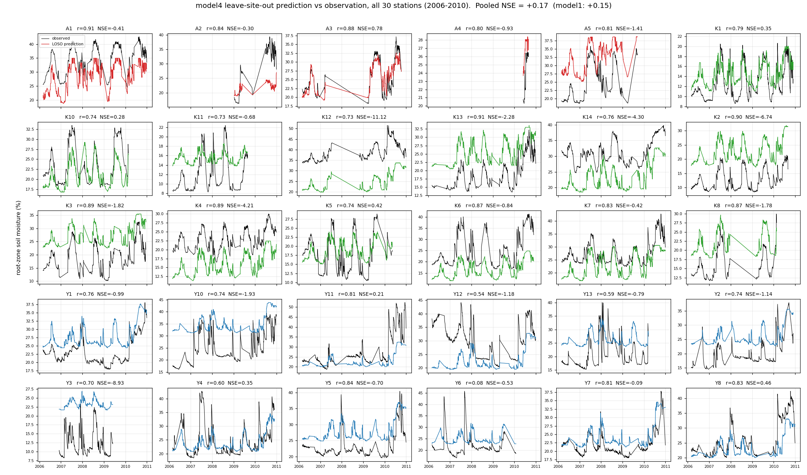

Prediction (colour) against observation (black); each title gives that station's
r and NSE. Dynamics track well throughout (median per-station r 0.80); the
remaining misses are level offsets (e.g. K12, K13 — parallel but shifted).

### The oracle ceiling: how much is left, and where

The remaining error can be located precisely. Any station's soil-moisture series
splits into two parts:

```
moisture(station, day) = station's long-term mean  +  daily departure from it
                         └───── the "level" ─────┘     └──── the "dynamics" ───┘
```

- the **level** is how wet a place is *on average* (Adelong ≈35 %, Yanco ≈22 %),
  set by local soil, climate and drainage — nearly constant in time;
- the **dynamics** are the wetting and drying *around* that mean, which SMIPS and
  seasonality track well.

A model must get **both** right. A prediction can reproduce the shape of the
wiggles perfectly and still score a poor NSE if it sits at the wrong height —
which is exactly the residual per-station bias (median per-station NSE −0.07
despite median r 0.80).

The **oracle** experiment isolates the two. For each held-out station it hands
the model that station's *true* mean level (which in real use is unknown,
because the station is unobserved) and keeps the same learned dynamics model
(trained only on the other stations, predicting daily departures). The
prediction becomes `true station mean + predicted departure`, so all level error
is removed and only the dynamics error remains:

| | pooled NSE | per-station NSE > 0 |
|---|---|---|
| model4 (must infer the level) | 0.35 | 14/30 |
| **oracle (level supplied)** | **0.83** | **28/30** |

The dynamics model is identical in both rows, so the entire 0.35 → 0.83 jump is
attributable to fixing the level. **The dynamics are nearly solved; almost the
whole remaining gap is the model's inability to guess a never-seen location's
baseline height.**

This is why *more sites* is the specific lever. The level is a per-location
property the model learns from the between-station spread in the training set
("sandy + low-rainfall + this SMIPS climatology → baseline ≈22 %"). With only 30
stations there are too few distinct (soil, climate, terrain) combinations to
learn that mapping, so a new site's level is guessed poorly. Adding stations does
not help the dynamics (already good) — it directly enriches the *level* model.
The 0.83 is an upper bound (real added sites give an imperfect level model, so
the realistic gain lies between 0.35 and 0.83), but it proves the headroom exists
and names the single component that unlocks it.

### Leave-region-out check

Because the winning configuration was selected on the same 30-station LOSO, it
was re-validated under leave-region-out (train two catchments, predict the
third — a split never used for selection): model1 −0.72 → model4 **+0.12**, with
every regional bias smaller (Kyeamba +0.45; Yanco bias +9.2 → +6.1; Adelong
−10.4 → −7.3). The gains generalise; the level problem under full-region transfer
is reduced but not solved.

## Soil smoothing experiment (model5, negative result)

The model4 downscaled field inherits blocky SLGA soil map-unit boundaries (see
[the model4 demonstration](#the-same-demonstration-with-model4)). A natural fix is
to Gaussian-blur the soil rasters; [`model5`](modules/model5.md) does this at both
training and inference. It cleans the map — Yanco demo ubRMSE 4.90 → 3.05 %,
r 0.30 → 0.39 — but a controlled blur sweep (σ=0 exactly reproduces model4)
shows leave-site-out skill falls monotonically, with no sweet spot:

| soil blur σ (px) | LOSO NSE | r | per-station NSE > 0 |
|---|---|---|---|
| **0 (= model4)** | **0.354** | 0.623 | 14/30 |
| 1 | 0.286 | 0.613 | 13/30 |
| 2 | 0.126 | 0.501 | 12/30 |
| 3 | 0.058 | 0.455 | 14/30 |

The reason is that soil is the **2nd most important predictor**: the sharp
per-station soil detail that makes the map blocky is the *same* signal that tells
the model how wet each station is relative to the others. Smoothing removes it
from both at once — the map artifacts and the tabular skill are two faces of one
signal and cannot be separated by a blur. This is the same lesson as the
[temporal-smoothing test](#the-improvement-search-model4) (which was also flat)
and the [oracle](#the-oracle-ceiling-how-much-is-left-and-where): the binding
constraint is the site-level information content, not preprocessing. model4
remains the recommended model.

## Limitations

- **Residual level bias on transfer.** The principal residual error remains a
  regional level offset, though much reduced: model4 halves the leave-site-out
  per-station deficit (median NSE −0.56 → −0.07) and moves leave-region-out from
  −0.72 to +0.12, but regional biases of ±6–7 % persist. Application to a
  climatically different region still warrants bias correction.
- **Training-set coverage.** Thirty stations across three catchments remain the
  binding constraint: the oracle diagnostic (NSE 0.83 with true station means)
  shows the remaining gap is almost entirely the site-level baseline, which more
  sites would constrain directly.
- **Single-date downscaling demonstration.** Stage 6 is evaluated on one date
  (for both model1 and model4); multi-date and seasonal evaluation remains
  outstanding (Stage 7).
- **Soil texture in the model4 map.** The model4 30 m field inherits blocky
  SLGA map-unit boundaries and mutes some fine terrain detail relative to the
  model1 map (see the model4 demonstration) — a per-station-calibration vs
  spatial-texture tradeoff to revisit with more sites or smoothed soil inputs.

## Future work

1. **More training sites (priority, now quantified).** The oracle diagnostic
   bounds the payoff: a perfect site-level model would take NSE from 0.35 to
   0.83. Adding stations (e.g. the scattered regional Murrumbidgee M-sites, or
   other networks) directly constrains the level model — the one component the
   current data cannot pin down — and would also let the SILO climate features
   (marginal at 30 sites) be re-tested.
2. **Bias correction.** A per-site offset or quantile mapping to SMIPS
   climatology would address the residual regional level bias (±6–7 % under
   leave-region-out for model4).
3. **Multi-date evaluation (Stage 7).** The model4 Yanco demonstration (above)
   is done for one date; a multi-date, multi-season leave-region-out evaluation
   of the 30 m fields would give transfer numbers that do not hinge on a single
   snapshot, and would show whether the soil-boundary texture cost varies with
   wetness state.
4. **Mass conservation.** Constrain the 30 m field to aggregate to a coarse
   reference within each cell (decomposition into cell mean plus terrain anomaly,
   with the mean rebased onto the reference). Requires a coarse reference in the
   target units (%); see the
   [`downscale.py` note](modules/downscale.py.md#future-work-not-yet-implemented).

## Reproducibility

Run from the repository root with the `paddockts` conda environment active (so
that `PaddockTS` and the cached inputs are available):

```bash
PYTHONPATH=. python handout/plot_grid_alignment.py  # grid_alignment
PYTHONPATH=. python handout/plot_results.py         # smips_correction, leave_site_out_cv, per_site_timeseries
PYTHONPATH=. python handout/plot_catchment.py       # catchment_results
PYTHONPATH=. python handout/plot_per_station.py     # catchment_per_station, kyeamba_per_station
PYTHONPATH=. python handout/plot_shrinkage.py       # shrinkage_diagnostic
PYTHONPATH=. python handout/plot_model4_results.py  # model4_results, model4_per_station
PYTHONPATH=. python handout/plot_downscale.py       # downscale_yanco (30 m field, model1)
PYTHONPATH=. python handout/plot_downscale_model4.py # downscale_yanco_model4
PYTHONPATH=. python handout/plot_downscale_model5.py # downscale_yanco_model5 (soil-smoothing tradeoff)
```

`plot_results.py` rebuilds the Kyeamba June–July 2020 table, reconstructs the
pre-correction SMIPS values for comparison, and runs the cross-validation.
`plot_catchment.py` and `plot_downscale.py` operate on the expanded table
(`data/train_catchment_2006_2010.csv`).

The module notes under [`modules/`](modules/) summarise each source file; the
implementation of record is in [`../emt/`](../emt/).
