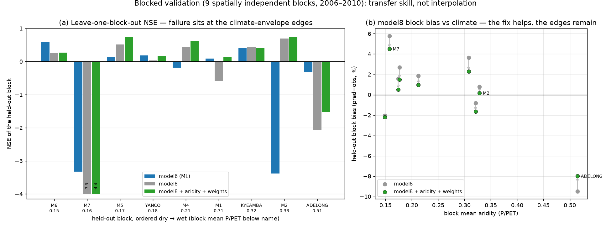
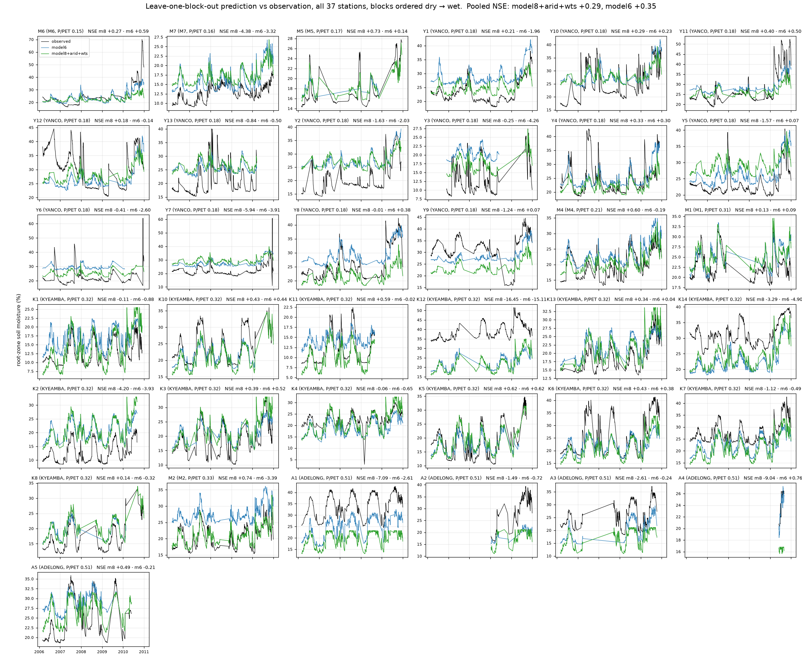
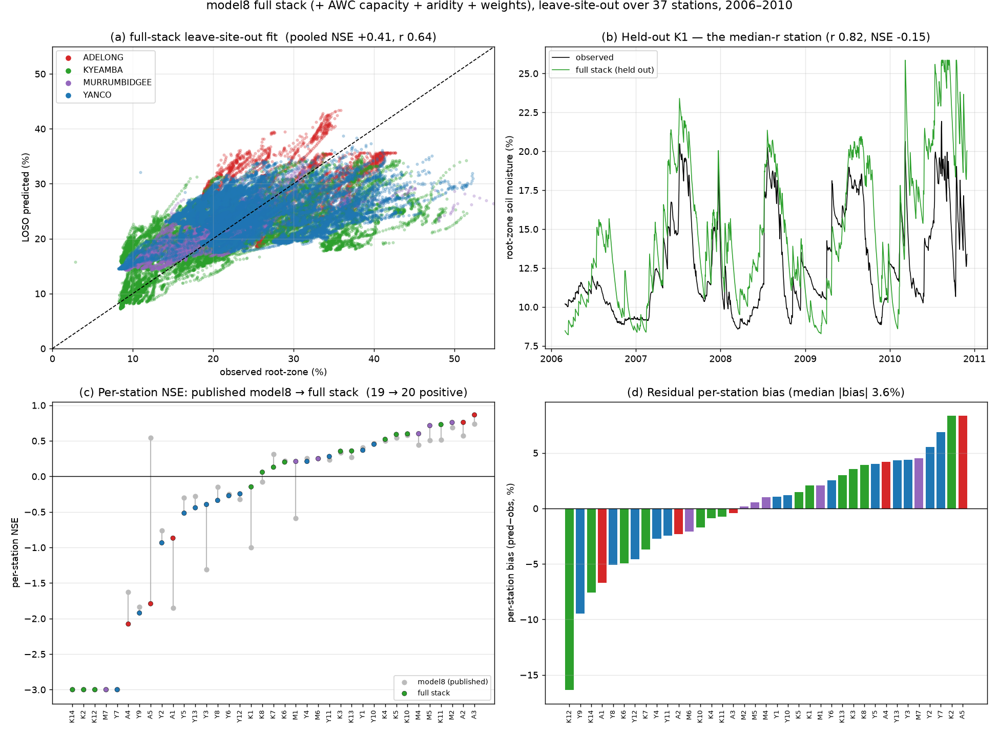
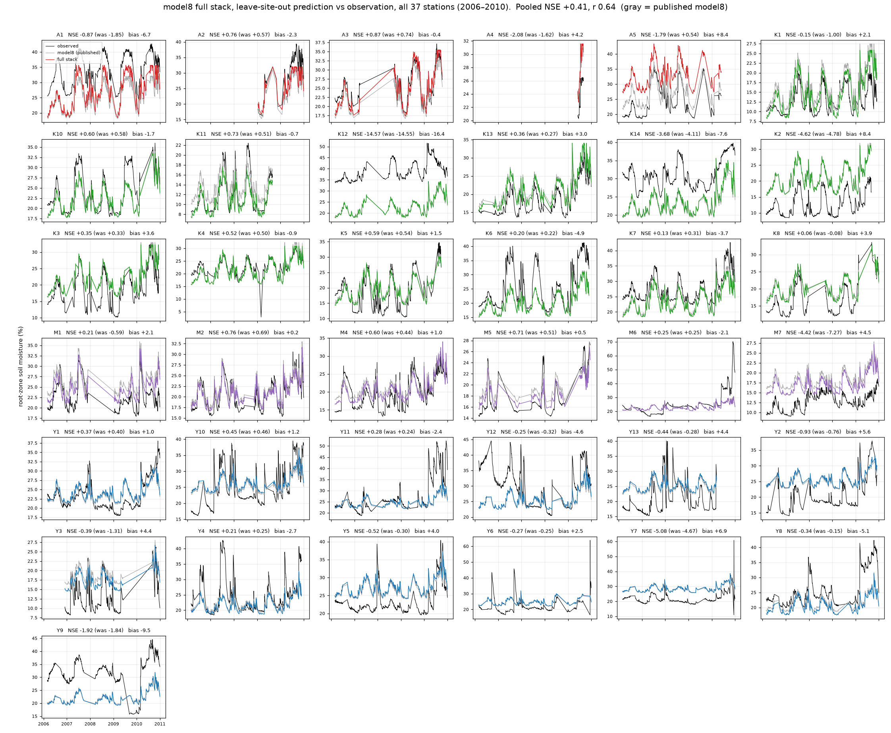

# Blocked validation — transfer skill, not interpolation

<!-- NAV -->
[← model8 · Process model + soil](model8.md) · [Index](../README.md) · [Downscaling to 30 m →](downscale.py.md)
<!-- /NAV -->

Source: [`../run_blocked_cv.py`](../run_blocked_cv.py) ·
figure: [`../plot_blocked_validation.py`](../plot_blocked_validation.py)

Every skill number in this handout so far is **leave-one-station-out**: hold
out one station, train on the other 36. But 26 of the 37 stations sit in two
tight clusters — Yanco's 13 stations span 0.57°, Kyeamba's 13 span 0.26° — so
a held-out station's neighbours **share its ~5 km SILO forcing cells and its
SLGA map units** and stay in training. Station-out CV therefore measures
*interpolation next to an instrumented site*. The intended product is a
national map, where the question is *transfer to places like nothing in the
training set* — and the effective sample for that question is not 37 stations
but **9 independent locations**: Yanco, Kyeamba, Adelong, and the six
scattered regional M-sites.

This page holds those 9 blocks out whole (leave-one-**block**-out) and scores
each held-out block, for [model8](model8.md) and [model6](model6.md), on the
37-station tables. Two training-side treatments are evaluated on top —
validation is always unweighted:

* **Stratified weights.** Stations classify cleanly into aridity (P/PET)
  tertiles (dry 0.15–0.18 · mid 0.18–0.32 · wet 0.33–0.60 — a genuine 4×
  climate gradient, rain 318→1006 mm/yr). Station-days per stratum are already
  balanced (18.3k / 17.2k / 15.2k), so flat stratum weights would be a no-op;
  the real imbalance is **within-stratum redundancy** (10 of the 13 dry-stratum
  stations are Yanco). The weights are therefore hierarchical — equal weight
  per stratum, split equally over the *blocks* inside it, then over samples —
  and tempered (`w**0.5`) so a tiny cell (A4: 89 obs) cannot dominate.
* **An aridity static (model8 only).** model8's ridge offset stage knew soil
  and terrain but nothing about climate, so a held-out site's *level* could not
  respond to it being wetter or drier country than the training set. Per-station
  mean P/PET (`data/process_climate_statics.csv`, derived from the SILO
  forcing; national, static, leakage-free) joins the statics — the same route
  soil took from model7 → model8.

## Results

| blocked, 9-fold | pooled NSE | block-median NSE | blocks NSE>0 | station-median NSE | median \|bias\| |
|---|---|---|---|---|---|
| model8 | +0.222 | +0.25 | 6/9 | −0.18 | 4.03 |
| model8 + weights | +0.234 | +0.27 | 6/9 | −0.04 | 3.52 |
| model8 + aridity | +0.256 | +0.23 | 7/9 | −0.02 | 3.81 |
| model8 + aridity + weights | +0.290 | +0.27 | 7/9 | −0.01 | 3.33 |
| model8 + AWC capacity | +0.238 | +0.23 | 6/9 | −0.25 | 4.00 |
| **model8 + capacity + aridity + weights** | **+0.322** | +0.25 | **7/9** | **+0.07** | **3.17** |
| model6 | +0.355 | +0.09 | 5/9 | −0.21 | 3.54 |
| model6 + weights | +0.379 | −0.14 | 4/9 | −0.27 | 3.55 |

Station-out references on the same tables: model8 pooled **+0.397**, station
median **+0.22**; model6 (36-station published) pooled +0.377.



Per-block, for the two headline configurations (blocks ordered dry → wet):

| block | aridity | model6 NSE / bias | model8+arid+wts NSE / bias |
|---|---|---|---|
| M6 | 0.15 | **+0.59** / −0.8 | +0.27 / −2.2 |
| M7 | 0.16 | −3.32 / +3.6 | **−4.38** / +4.5 |
| M5 | 0.17 | +0.14 / +1.3 | **+0.73** / +0.5 |
| YANCO | 0.18 | +0.19 / +3.1 | +0.17 / +1.5 |
| M4 | 0.21 | −0.19 / +3.5 | **+0.61** / +1.0 |
| M1 | 0.31 | +0.09 / +1.9 | +0.13 / +2.3 |
| KYEAMBA | 0.32 | +0.41 / −1.2 | +0.41 / −1.7 |
| M2 | 0.33 | **−3.39** / +6.7 | **+0.74** / +0.2 |
| ADELONG | 0.51 | −0.33 / −4.5 | −1.53 / −8.0 |

Held-out prediction vs observation for every station under the blocked folds
([`plot_blocked_per_station.py`](../plot_blocked_per_station.py); observed
black, model6 blue, model8+aridity+weights green — panels grouped by block,
dry → wet):



The panels make the aggregate story concrete: at almost every station both
models track the *wetting–drying rhythm* and miss (or hit) the *level* — the
whole series sits offset. The Adelong row shows both models flat-lining
several percent below the observed range; M2 shows model6's series riding
above the observations while model8's sits on them. The panels also expose a
within-block extreme the block table averages away: **K12**, the wettest
station in the set (mean 39 %), is missed by ~15 % by *both* models (NSE ≈
−16/−15) even though its block, Kyeamba, scores +0.41 — level failure is not
only a between-block, climate-edge phenomenon; the wet extreme *within* a
block fails the same way.

## Findings

**1 · The station-out headlines are substantially neighbour leakage.**
model8's pooled NSE drops +0.40 → +0.22 under blocking and its per-station
median flips sign (+0.22 → −0.18): the published between-site level skill
mostly came from having same-cluster neighbours in training. model6's *pooled*
barely moves (+0.38 → +0.36) — but only because pooled is 76 % Yanco+Kyeamba
rows and each big cluster covers for the other; its block-median is +0.09.

**2 · Failure concentrates at the climate-envelope edges, as level error.**
The two catastrophic blocks are the driest station (M7, model8 bias +5.8 %)
and the wettest cluster (Adelong, aridity 0.45–0.60 against a training
maximum of 0.38 once it is held out; bias −9.5 %). Meanwhile **r stays
0.65–0.91 at every failed block** — the dynamics transfer fine; it is purely
the level that cannot extrapolate. Inside the sampled envelope, transfer is
respectable (M2/M4/M5 at +0.61…+0.74 for the final model8).

**3 · The aridity static and the weights both help model8 — every aggregate,
monotonically.** Together they lift pooled +0.222 → +0.290, block-median
+0.25 → +0.27 (7/9 blocks positive), station median −0.18 → −0.01, median
|bias| 4.03 → 3.33. But they only *shrink* the edge failures (M7 −7.3 → −4.4,
Adelong −2.1 → −1.5): when Adelong is held out the ridge must extrapolate its
aridity coefficient far beyond the training range, and rightly shrinks it. **No
reweighting or covariate fixes an empty region of predictor space — only
observations there do.**

**3b · The physical capacity route, dropped under station-out, earns its
place under blocking.** [model8's page](model8.md#what-was-tested-and-not-defaulted)
tested SLGA AWC as *per-station bucket capacity* (`capacity=` — higher-AWC
soils genuinely hold and read out more water) and did not default it: its
solo station-out gain was negligible because AWC barely varies here
(10.9 ± 0.7 %). Alone it is indeed weak blocked too (+0.24 pooled,
station-median −0.25). But **stacked on aridity + weights it is the best
configuration measured**: blocked pooled **+0.322**, the first *positive*
blocked station-median (**+0.07**), median |bias| 3.17, Adelong −1.53 → −1.03
— while at station-out it is free (pooled +0.408 vs the published +0.397,
median |bias| 3.57). The physical and statistical fixes address different
parts of the level error and compose.

**4 · Weights help model8 and hurt model6.** model6's block-median *drops*
under the same weights (+0.09 → −0.14, 4/9 blocks positive): up-weighting
single M-stations pushes a 127-leaf boosting model to fit their quirks in a
way a 14-parameter ridge cannot. Sample weighting is model8 policy, not a
blanket training change.

**5 · The GBM interpolates better; the bucket transfers better — and they
fail in different places.** model6 wins pooled (+0.36 vs +0.29); model8 wins
everything block-level (median +0.27 vs +0.09). model6 collapses at **M2**
(bias +6.7 %) where model8 is *excellent* (+0.74); model6 nearly survives
**Adelong** (−0.33, and −0.14 weighted) where model8 fails — its antecedent
rain features carry exactly the climate signal model8's statics lacked. Both
fail M7. This per-block complementarity is the strongest evidence yet for the
hybrid flagged in [model7](model7.md) (bucket storage as an ML feature, or
SMIPS assimilated into the bucket).

## Reconciling with model7's rejection of climate normals

[model7's page](model7.md#per-station-terrain-offsets-two-stage-ridge)
documents a negative result that appears to contradict finding 3: climate
normals (mean rain, PET, **aridity**) were tested in the same offset slot and
*reduced* station-out skill. That result is real and **replicates on model8**
— the contradiction is between harnesses, not results:

| model8 config | station-out pooled / stn-median | blocked pooled / stn-median |
|---|---|---|
| published (soil + terrain) | **+0.397 / +0.22** | +0.222 / −0.18 |
| + aridity | +0.388 / +0.13 | +0.256 / −0.02 |
| + aridity + weights | +0.403 / +0.13 | +0.290 / −0.01 |
| + capacity + aridity + weights | +0.408 / +0.13 | **+0.322 / +0.07** |

Under **station-out**, a held-out station's cluster neighbours — with its
climate — are in training, so a climate normal adds no new information and
acts as a weak cluster identifier the ridge can misuse: mild harm, exactly as
model7 found. Under **blocked** hold-out the station's climate is *absent*
from training, and the normal is the only channel telling the readout "this is
wetter/drier country than anywhere you trained": consistent gain. Whether
aridity belongs in the statics is therefore not a fixed fact about the model —
it depends on which deployment the validation is standing in for, which is
why adopting it is a genuine trade (interpolation station-median −0.09,
transfer pooled +0.07) rather than a free win.

### The full stack at station-out, in full

The candidate configuration's station-out results in the same format as the
published model8's ([`plot_model8_fullstack_results.py`](../plot_model8_fullstack_results.py),
[`plot_model8_fullstack_per_station.py`](../plot_model8_fullstack_per_station.py);
reproduce the predictions with `run_blocked_cv.py m8capaw@station`):





Panel (c) and the per-station grid show where the station-median cost lives:
the biggest single regression is **A5** (+0.54 → −1.79, bias +8.4 %) — with
aridity in the statics, held-out Adelong stations are pulled toward the
global climate–moisture relation, which helps the block's outliers (A1
−1.85 → −0.87, A2/A3 up) but overshoots its best-behaved station. The M-sites
are the mirror image: M1 flips positive (−0.59 → +0.21), M7 improves
−7.3 → −4.4, M2/M4/M5 all rise — the same climate channel that costs a
cluster's easiest station buys skill exactly where stations stand alone.
K12's ~−16 is untouched by any of it, consistent with its wet extreme being
outside what any static can encode. Aggregate per-block (station-out folds):
Adelong lands at **+0.11 with bias −0.44** — against **−1.03 / −7.1 blocked**
— the leakage mechanism stated as a single comparison.

## Implications

* **The honest headline for a national product is the blocked one:** model8
  transfers at pooled NSE ≈ +0.29 (block-median +0.27) *within the sampled
  climate envelope* (aridity ≈ 0.15–0.6), and degrades to level failure
  outside it. The station-out +0.40 remains the right figure for the
  interpolation use-case (predicting near an instrumented site).
* The aridity static + stratified weights + AWC capacity are cheap,
  principled improvements for model8 — candidates for its default
  configuration (the full stack costs 0.09 station-median at station-out;
  everything else improves in both harnesses).
* The remaining edge failure is a **data** limitation. The productive next
  investments are a pedotransfer readout (θ from SLGA bulk density / AWC
  rather than two fitted globals) and, above all, the national in-situ
  network the README already plans — a catchment cannot validate a continent.
* Not yet done, and material: a **temporal** hold-out (year folds). 2006–2010
  spans the Millennium Drought's tail and its 2010 break, and model8's
  headline feature is running forward to the present.

## Reproduce

```bash
PYTHONPATH=. python handout/run_blocked_cv.py                # every blocked configuration
PYTHONPATH=. python handout/run_blocked_cv.py m8capaw        # or any subset
PYTHONPATH=. python handout/run_blocked_cv.py m8capaw@station  # full stack, station-out folds
PYTHONPATH=. python handout/plot_blocked_validation.py       # summary figure
PYTHONPATH=. python handout/plot_blocked_per_station.py      # blocked per-station series
PYTHONPATH=. python handout/plot_model8_fullstack_results.py       # full stack station-out, 4-panel
PYTHONPATH=. python handout/plot_model8_fullstack_per_station.py   # full stack station-out, series
```

Out-of-fold predictions land in `data/model{6,8}_blockcv*_predictions.csv`.
model6's runs need its feature table (built and cached to
`data/model6_features_2006_2010.csv` on first use — fetches the 2005 SMIPS
climatology seed). Both models run on the 37-station tables (the ML table
gained Y9 relative to the published 36-station results; see the repo history).
Weighted model8 uses `BucketEstimator.fit(..., sample_weight=…)`, whose
unweighted path is regression-identical to the published fits.

---
<!-- NAV -->
[← model8 · Process model + soil](model8.md) · [Index](../README.md) · [Downscaling to 30 m →](downscale.py.md)
<!-- /NAV -->
