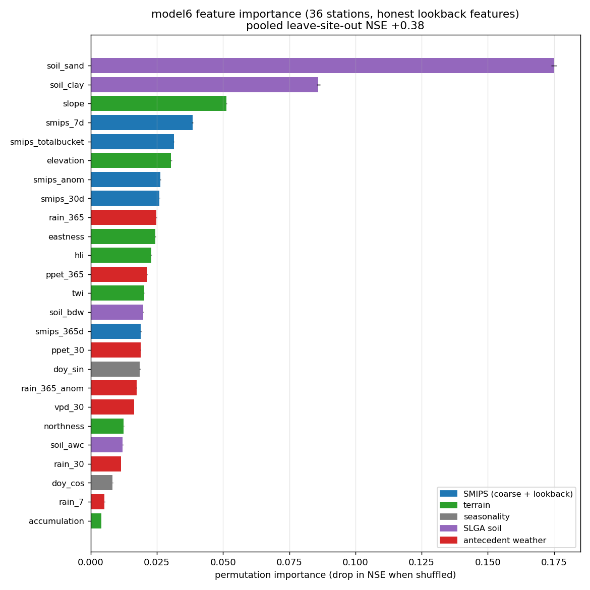

# `model6`: model4 + antecedent meteorology (recommended)

<!-- NAV -->
[← model5 · Soil smoothing](model5.md) · [Index](../README.md) · [Downscaling to 30 m →](downscale.py.md)
<!-- /NAV -->

Source: [`../../emt/model6/model.py`](../../emt/model6/model.py)

[`model4`](model4.md)'s features extended with **SILO trailing-window
meteorology** ([`antecedent.py`](../../emt/antecedent.py)) — how much rain has
fallen and how the water balance and evaporative demand have run over the **past
week, month and year** — with its **own** tuned estimator:

```
model4 features + rain_7/30/365 + ppet_30/365 + vpd_30 + rain_365_anom
```

| Metric (36 stations, 2006–2010, leave-site-out) | model4 | **model6** |
|---|---|---|
| Pooled NSE / r | 0.31 / 0.58 | **0.38 / 0.62** |
| Median per-station NSE | −0.57 | **−0.19** |
| Median per-station \|bias\| | 4.88 % | **3.85 %** |
| Per-station NSE > 0 | 10/36 | **16/36** |

These are the leak-free numbers (see the
[Evaluation correction](../README.md#evaluation-correction)); an earlier version
reported ~0.39 from a look-ahead in the SMIPS-climatology features. Read the
pooled +0.38 alongside the conservative grouped-CV (≈+0.25) and the still-negative
per-station median: model6 tracks *dynamics* well (median per-station r 0.81) but
the per-station *level* bias is reduced, not solved.

The leave-site-out fit, feature importance, the model4 → model6 per-station NSE
comparison and the residual bias are in the four-panel
[`plot_model6_summary.py`](../plot_model6_summary.py) →
`figures/model6_results.png`; the per-station held-out time series are
[`plot_model6_results.py`](../plot_model6_results.py) →
`figures/model6_per_station.png`. Both read cached predictions
(`data/*_loso_predictions.csv`) and the saved model
(`data/models/model6.joblib`), so they never re-run the CV.


## Feature importance



Permutation importance ([`plot_model6_importance.py`](../plot_model6_importance.py))
on the honest lookback features. With the look-ahead removed, **SLGA soil
dominates** (`soil_sand`, `soil_clay`) — it now carries most of the static
between-site *level* signal the leaky SMIPS-climatology used to supply. Terrain
(`slope`, `elevation`), the SMIPS lookback (`smips_7d`, `smips_totalbucket`,
`smips_anom`) and antecedent water balance (`rain_365`, `ppet_365`) follow. Worth
noting: soil being top is a double-edged result — it is also the feature most
likely to behave as a per-station identifier (see
[`slga.py`](slga.py.md)), so its dominance is a reason the per-station level bias
is reduced but not solved.

## Why antecedent meteorology

Soil moisture is set by how much water has recently arrived versus left. The
SMIPS value and the SMIPS lookback windows capture the *state* and the *level*,
but the water balance `P − PET` (rain minus potential evapotranspiration) and
evaporative demand add recent-accumulation signal SMIPS does not fully separate.
Adding the antecedent features lifts pooled NSE from 0.31 to 0.40 and cuts the
median per-station |bias| from 4.9 % to 3.9 % — a real gain even after the leak
was removed. All are dynamic per-pixel SILO series (national ≈5 km daily grid),
computable at every 30 m pixel and unable to memorise station identity — the same
leakage test the other features pass, and every window is strictly backward. SILO
is fetched one year before the study start so the 365-day window is complete.

## Its own tuned estimator (opposite of model4)

model6 has a **different** `build_estimator` from model4, because the two
feature sets want opposite regularisation once tuned honestly (GroupKFold on
station, never on the leave-site-out score):

| | model4 | model6 |
|---|---|---|
| `max_leaf_nodes` | 3 (tiny trees) | **127** (large trees) |
| `max_features` | 0.5 | **0.15** (heavy per-split subsampling) |
| `min_samples_leaf` | 150 | 20 |

(The tuned optimum is *unlimited* trees — LOSO 0.40 — but one cross-validation of
that takes ~90 min; the production config caps `max_leaf_nodes` at 127, giving
0.377 at ~1/8 the cost, so the model is actually usable.)

The `max_leaf_nodes=3` "extreme regularisation" that looked optimal in the earlier
(leaky) analysis was an **artefact of the leak** — tiny trees couldn't overfit the
look-ahead level signal. With leak-free features model6 instead wants large,
expressive trees whose variance is controlled by feature subsampling; a
single-parameter sweep put the optimum at `max_features=0.15` (skill flat 0.15–0.3,
collapsing above 0.3).

## Status

model6 is the **recommended** model — it beats [`model4`](model4.md) on every
leave-site-out metric on the 36-station set. It is not a finished product: the
per-station level bias persists (see the README). Inference needs the SILO
antecedent rasters over the AOI in addition to model4's SMIPS-lookback and soil
layers (the inference path is being updated to the lookback features).

---
<!-- NAV -->
[← model5 · Soil smoothing](model5.md) · [Index](../README.md) · [Downscaling to 30 m →](downscale.py.md)
<!-- /NAV -->
