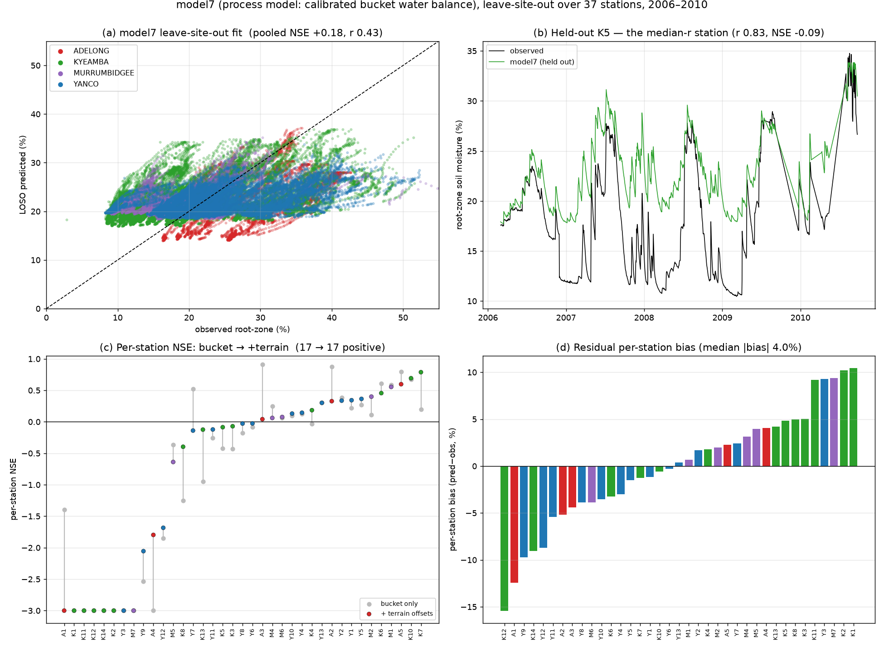
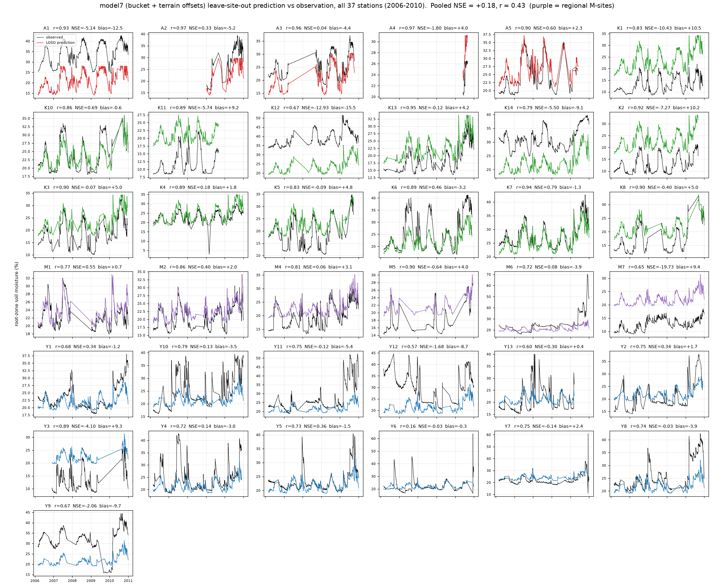

# `model7`: a process model — calibrated bucket water balance

<!-- NAV -->
[← model6 · Antecedent meteorology](model6.md) · [Index](../README.md) · [Downscaling to 30 m →](downscale.py.md)
<!-- /NAV -->

Source: [`../../emt/model7/model.py`](../../emt/model7/model.py) ·
data builder [`../../emt/model7/build.py`](../../emt/model7/build.py)

Every model so far is a statistical estimator over covariates. model7 replaces
the estimator with **simulation**: a single-layer daily bucket water balance
over the 0–90 cm profile, forced only by SILO rain and Morton potential ET —
**no SMIPS, no soil, no terrain in the state equation, no machine learning**:

```
S' = clip(S + P − AET − k·S, 0, smax)        AET = PET · min(1, S/(α·smax))
vwc% = θr + Δθ · S/smax
```

Five global parameters (`smax`, `α`, `k`, `θr`, `Δθ`) are *calibrated* on the
training stations inside `fit` — the process-model analogue of estimator
training — so model7 runs through the **identical leave-site-out harness** as
models 1–6 (`FEATURES = ["station", "time"]` are keys into a continuous daily
forcing store, not covariates). Simulation starts 2005-01-01 at half capacity,
one full spin-up year before any scored date.

The question it answers: **how much of the ML models' skill is just
water-balance bookkeeping** — and how much genuinely needs the covariates?

| Metric (37 stations, 2006–2010, leave-site-out) | bucket only | **+ terrain offsets** | model6 (36 stn) |
|---|---|---|---|
| Pooled NSE / r | +0.15 / 0.39 | **+0.18 / 0.43** | +0.38 / 0.62 |
| Median per-station NSE | −0.08 | **−0.03** | −0.19 |
| Per-station NSE > 0 | 17/37 | 17/37 | 16/36 |
| Median per-station r | 0.83 | **0.83** | 0.81 |
| Median per-station \|bias\| | 3.70 % | 3.98 % | 3.85 % |

(model7 keeps all 37 coordinate-resolved stations — it loses none to SMIPS
gaps, so its table has one station more than the ML models'. Read the model6
column as a reference, not a same-rows comparison.)

**The split is stark.** On *within-station temporal skill* the 5-parameter
bucket matches the 25-feature gradient-boosting model: median per-station r
0.83 vs 0.81, median per-station NSE −0.03 vs −0.19, positive-NSE stations
17/37 vs 16/36. On the *pooled* score — which rewards ranking sites against
each other — it reaches less than half of model6 (+0.18 vs +0.38). Most of the
year-to-year moisture signal at a point **is** water-balance bookkeeping;
what the covariates (chiefly SLGA soil, see
[model6's importance](model6.md#feature-importance)) buy is the **between-site
level structure** that a globally-parameterised process model cannot express.



Panel (a) shows the cost of global parameters directly: the predicted range is
compressed toward the middle (≈15–35 %) while observations span 3–52 % — the
same shrinkage-of-levels failure mode diagnosed for
[model1](model1.md), arrived at from the opposite direction. Panel (b) is the
flip side: the median-r station tracks every wetting and dry-down through five
years, held out.

Held-out predicted-vs-observed time series for every station
([`plot_model7_per_station.py`](../plot_model7_per_station.py), from the cached
LOSO predictions):



The failure mode is uniform and readable station by station: where model7 is
wrong it is wrong by a **constant** — A1 (r 0.93, bias −12.5 %), K12 (r 0.67,
bias −15.5 %) and K1 (r 0.83, bias +10.5 %) ride the observed series at a fixed
offset — while stations whose level the offsets catch sit directly on the
observations (K7 NSE 0.79, K10 0.69, A5 0.60, M1 0.55). Dynamics are never the
problem: 30 of 37 stations have held-out r ≥ 0.7.

## Per-station terrain offsets (two-stage ridge)

The one seat the process model offers for between-site structure is a static
offset on the readout. This is fitted in a **second stage**: calibrate the
bucket first, then ridge-regress the per-station *mean residuals* (one sample
per training station) on standardised terrain statics (`twi`, `slope`,
`elevation` from the 30 m Copernicus DEM), penalty chosen by leave-one-out over
the training stations. A held-out station gets its offset from its *own*
covariate values, never from its observations.

Two negative results shaped this design, both worth keeping:

* **Plain least squares fails.** Profiling the offsets by OLS inside the
  calibration *lowered* leave-site-out skill (pooled +0.13–0.09): with only ~36
  station levels to fit, unregularised coefficients memorise the training
  stations and transfer badly. The ridge (fitted α ≈ 46 — heavy shrinkage) is
  what makes the offsets honest, and its gain is correspondingly modest:
  pooled +0.15 → +0.18, median per-station NSE −0.08 → −0.03.
* **Climate normals don't transfer.** Per-station climatological statics from
  the same forcing (mean annual rain, PET, aridity P/PET) were tested in the
  same slot and *reduced* pooled skill (+0.12 with aridity, +0.04 with all
  three) — at these scales the forcing already carries that information
  dynamically, and the normals act as weak station identifiers.

The fitted coefficients have physical signs: wetter at high TWI (+0.71 % per
sd), drier on steeper slopes (−0.81), slightly drier with elevation (−0.23).

## What this says about the ML models

1. **model6's per-station dynamics are not evidence of learned physics** — a
   5-parameter bucket reproduces them from rain and PET alone. The ML models
   earn their keep on the cross-site problem, not the temporal one.
2. **The level problem is information-limited, not model-limited.** Neither a
   histogram-gradient-boosting model with 25 covariates nor a process model
   with terrain offsets ranks unseen sites well; model6's advantage rides on
   SLGA soil. A process route to the same information exists — set `smax` from
   SLGA available water capacity instead of calibrating it globally — and is
   the obvious next experiment (SLGA needs a TERN key, which this environment
   did not have).
3. **A hybrid is the natural continuation**: bucket storage (or its anomaly) as
   a *feature* for the ML models, or SMIPS assimilated into the bucket — the
   two models fail differently, and the progress report's §5.5 hybrid
   recommendation points the same way.

## Data & running

model7 does not read the ML training table. Its inputs are built by
[`emt/model7/build.py`](../../emt/model7/build.py) (all public; SILO needs only
a registered email, the Copernicus DEM nothing):

```bash
PYTHONPATH=. python -m emt.model7.build     # target + forcing + terrain statics
PYTHONPATH=. python -m emt.model7.model data/process_target_2006_2010.csv
```

`data/process_forcing_2005_2010.csv` holds continuous daily rain/PET/VPD per
station from one year before the study (spin-up); `process_terrain_statics.csv`
holds the per-station 30 m terrain values (station Y9's 1.5 km window
degenerates at a DEM tile boundary and is retried with a larger buffer under a
distinct stub). The simulation core is numba-JIT'd when numba is present
(~0.5 ms per 6-year × 37-station run) and plain numpy otherwise; one full
leave-site-out pass takes ~90 s.

## Status

model7 is a **diagnostic baseline, not a replacement**: [model6](model6.md)
remains the recommended mapping model. Its value is the decomposition — it
isolates how much skill needs no covariates at all (most of the temporal
signal), pins the ML models' real contribution to the between-site level
problem, and provides an ML-free reference any future model must beat. Applying
it as a 30 m field would need the terrain-offset readout on the DEM grid plus
gridded SILO forcing (both national), but a map is not its point.

---
<!-- NAV -->
[← model6 · Antecedent meteorology](model6.md) · [Index](../README.md) · [Downscaling to 30 m →](downscale.py.md)
<!-- /NAV -->
