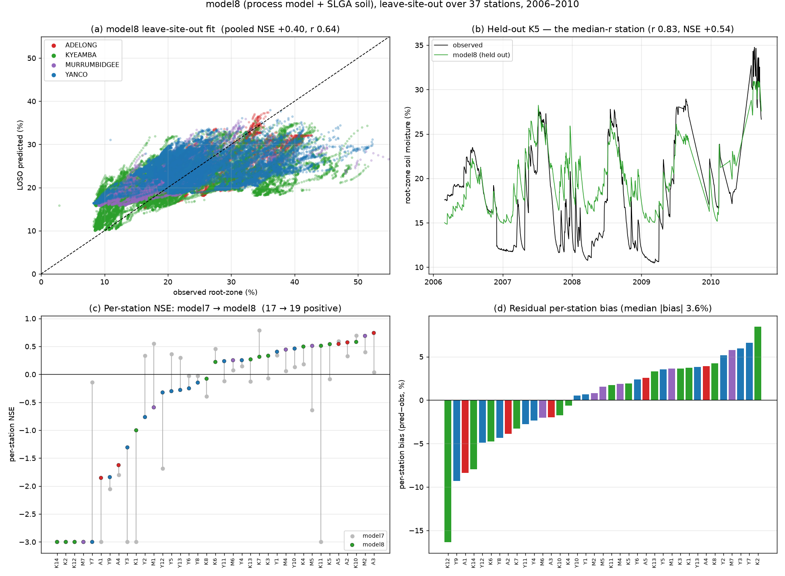
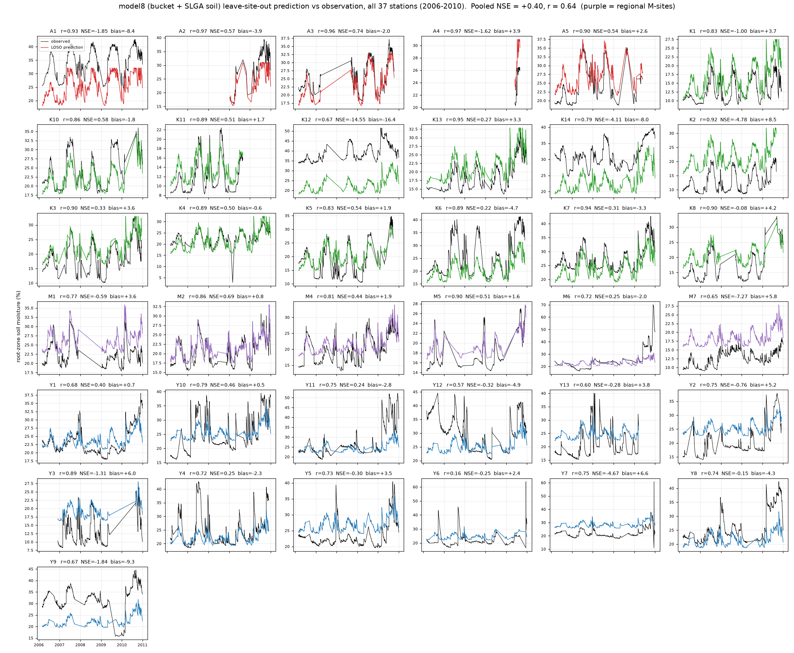
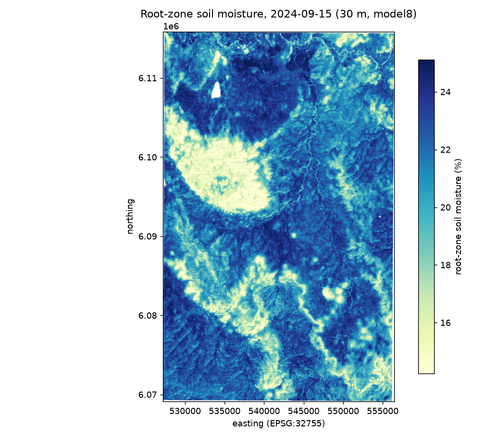

# `model8`: model7 + SLGA soil — the process model at ML parity

<!-- NAV -->
[← model7 · Process model](model7.md) · [Index](../README.md) · [Blocked validation →](blocked_validation.md)
<!-- /NAV -->

Source: [`../../emt/model8/model.py`](../../emt/model8/model.py)

The same calibrated bucket water balance as [`model7`](model7.md) — same five
parameters, same SILO-only forcing, same two-stage fit — with exactly one
change: **SLGA root-zone soil** (clay, sand, AWC, bulk density) joins terrain
in the ridge offset stage. One line of configuration, and the pooled
leave-site-out skill **doubles to parity with the ML models**:

| Metric (37 stations, 2006–2010, leave-site-out) | model7 | **model8** | model6 (36 stn) |
|---|---|---|---|
| Pooled NSE / r | +0.18 / 0.43 | **+0.40 / 0.64** | +0.38 / 0.62 |
| Median per-station NSE | −0.03 | **+0.22** | −0.19 |
| Per-station NSE > 0 | 17/37 | **19/37** | 16/36 |
| Median per-station r | 0.83 | 0.83 | 0.81 |
| Median per-station \|bias\| | 3.98 % | **3.64 %** | 3.85 % |

(Same caveat as model7: the model6 column is the published 36-station
reference, not a same-rows rerun.) The bucket supplies the temporal signal
(r 0.83, unchanged), the soil maps supply the between-site level ranking — and
with both in place a **13-parameter interpretable model matches a tuned
gradient-boosting model pooled (+0.40 vs +0.38) while beating it clearly
per-station (median NSE +0.22 vs −0.19)**.

That both tracks converge on soil — the ML track through [feature
importance](model6.md#feature-importance), the process track through what
unlocks its level ranking — is strong independent evidence the signal is real
and physical, not an artefact of either method.



The fitted offset coefficients (%-per-training-sd, ridge α ≈ 22) are textbook
soil physics, which is what makes them credible at held-out sites: **clay
+1.43** (finer soils hold more water), **sand −1.41**, bulk density −0.40,
TWI +0.67, slope −0.71 — and AWC ≈ 0 (see below).

Held-out predicted-vs-observed time series for every station
([`plot_model8_per_station.py`](../plot_model8_per_station.py)):



## What was tested and not defaulted

* **AWC as per-station bucket capacity** — the physically-motivated route
  (`capacity=` on the estimator: SLGA available water capacity scales `smax`,
  so higher-capacity soils genuinely sit wetter). Its LOSO gain is negligible
  (+0.16 vs +0.15 pooled alone; no gain on top of the offsets) because AWC
  barely varies across these 37 stations (10.9 ± 0.7 %). The machinery stays
  in [`model7/model.py`](../../emt/model7/model.py) for regions with real AWC
  contrast. **Revisited under blocked validation**: stacked on the aridity
  static and stratified weights it becomes part of the best transfer
  configuration measured (blocked pooled +0.32, the first positive blocked
  station-median) while costing nothing at station-out — see the
  [blocked-validation page](blocked_validation.md).
* **Soil offsets without terrain** scored the same pooled (+0.41) but much
  worse per-station (median NSE +0.05 vs +0.22); the terrain trio earns its
  place alongside soil.

## Run it for any date

The fitted model ships in the repo (`data/models/model8.joblib`, 6 KB — it is
13 numbers plus the standardisation constants), and
[`emt/model8/predict.py`](../../emt/model8/predict.py) applies it **anywhere in
Australia, for any day**, as a point series or a 30 m map:

```bash
# daily series at a point, any date range
PYTHONPATH=. python -m emt.model8.predict \
    --lat -35.05 --lon 147.5 --start 2025-06-01 --end 2025-06-10

# 30 m map for one day
PYTHONPATH=. python -m emt.model8.predict \
    --bbox 147.30 -35.52 147.62 -35.10 --date 2024-09-15
```

```python
from emt.model8.predict import predict_point, predict_map
s  = predict_point(lat=-35.05, lon=147.5, start="2024-01-01", end="2024-12-31")
ds = predict_map(bbox=(147.30, -35.52, 147.62, -35.10), day="2024-09-15")
ds["sm_pred"]        # 30 m root-zone soil moisture (%)
```

**Why any date works without retraining.** model8 has no lookback *features* —
it has a *state*. To predict day D the bucket is run forward from a spin-up
start to D on SILO rain/PET, so 2006 and last week cost the same and need no
SMIPS at all (unlike [`emt/predict.py`](predict.py.md), which must assemble the
SMIPS lookback for the day). A station cross-check confirms the inference path
reproduces the training path to machine precision (max |Δ| 0.0000 % at K5,
independent spin-ups).

**The spin-up, precisely.** Simulation starts on **1 January, two calendar
years before your start date** — so a June 2025 request simulates from January
2023, about 2.4 years of lead-in. That window exists only to wash out the
arbitrary initial condition (`S = 0.5 · smax`); it is **not** a limit on which
dates you can predict, and it does not need in-situ data. Its only real cost is
fetch time on a cold run, since in map mode every forcing cell pulls that many
years of SILO.

Two years is deliberately generous. Holding the forcing fixed and varying only
the spin-up, at one Murrumbidgee point for 2025-06-01:

| Spin-up | 0.25 yr | 0.5 yr | 1 yr | 2 yr | 4 yr | 10 yr |
|---|---|---|---|---|---|---|
| Storage (mm) | 43.28 | 40.68 | 40.68 | 40.68 | 40.68 | 40.68 |
| Predicted VWC (%) | 17.724 | 17.473 | 17.473 | 17.473 | 17.473 | 17.473 |

Everything from **six months** out is identical to a ten-year spin-up; only the
three-month run drifts (+0.25 %). That is exactly what the fitted recession
predicts — `k = 0.0073/day` is a 137-day (4.6-month) e-folding — so the default
carries roughly a 4× margin. Lower `SPINUP_YEARS` to 1 in
[`predict.py`](../../emt/model8/predict.py) for faster cold starts; it still
leaves a 2× margin.

The map is a genuine downscaling of the same kind the repo does elsewhere: the
**water balance runs on the ~5 km SILO forcing grid** — the scale at which
weather actually varies — and the **30 m structure comes from the per-pixel
soil and terrain offsets**. Outputs are a GeoTIFF plus a quick-look PNG in the
AOI's PaddockTS query dir; `--step-deg` tunes the forcing grid, `-o` writes an
extra copy.

Kyeamba on 2024-09-15 — 1.6 M pixels from the command above, a date fourteen
years past the training period:



Drainage lines and valley floors sit wet, ridges and the steep north-western
block dry — the TWI and slope terms doing visible work, with SLGA map-unit
boundaries showing as the broader patches. Costs on a first run are the 30
cached SILO cell downloads (~2 years each) plus terrain and soil for the AOI;
later days over the same area reuse all of it.

## Data & running

Retraining (not needed to predict) reads the same inputs as model7 plus
`data/process_soil_statics.csv`, all built by
[`emt/model7/build.py`](../../emt/model7/build.py) — the soil step needs a
**TERN API key** in `~/.config/PaddockTS.json` and is skipped with a notice
otherwise (model7 remains fully runnable without it).

```bash
PYTHONPATH=. python -m emt.model7.build     # target + forcing + terrain + soil
PYTHONPATH=. python -m emt.model8.model data/process_target_2006_2010.csv
```

## Spatial transfer — read the headline with the blocked numbers

The table above is **leave-one-station-out**, which leaves a held-out
station's cluster neighbours (same ~5 km forcing cells, same soil map units)
in training — an *interpolation* estimate. Holding out whole spatially
independent blocks instead (9 folds: Yanco, Kyeamba, Adelong, each M-site)
drops model8 to **pooled +0.22, station-median −0.18**: much of the
between-site level skill above is neighbour leakage. Two cheap, monotone fixes
recover part of it — an **aridity static** in the offset stage (climate was
the one thing the level model couldn't see) and **stratified sample weights**
— for a blocked **pooled +0.29, block-median +0.27, 7/9 blocks positive,
station-median −0.01**. What remains fails at the climate-envelope *edges*
(the driest station, the wettest cluster) as pure level error with r intact —
a data limitation, not a modelling one. Full experiment, per-block tables and
figure: [Blocked validation](blocked_validation.md).

## Status

model8 is the **recommended model of the process track** ([model7](model7.md)
stays as its covariate-free foundation) and a full peer of
[model6](model6.md): pooled parity, better per-station medians, 13
interpretable parameters, no training table, and no dependence on SMIPS at
all. Its caveats are the shared ones — no temporal hold-out, no validation
outside the Murrumbidgee — plus the spatial-transfer picture above: the
station-out skill is the interpolation figure, the
[blocked](blocked_validation.md) +0.29 the transfer figure. The two tracks
fail differently (see the blocked page's per-block table), which is what makes
the hybrid flagged in model7 (bucket storage as an ML feature, or SMIPS
assimilated into the bucket) the natural next step.

---
<!-- NAV -->
[← model7 · Process model](model7.md) · [Index](../README.md) · [Blocked validation →](blocked_validation.md)
<!-- /NAV -->
