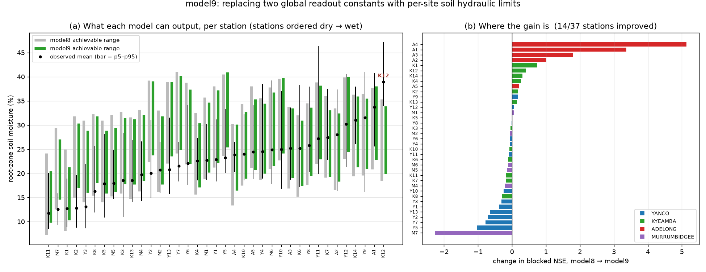

# `model9`: a pedotransfer readout — physics where two constants used to be

<!-- NAV -->
[← Blocked validation](blocked_validation.md) · [Index](../README.md) · [Temporal validation →](temporal_validation.md)
<!-- /NAV -->

Source: [`../../emt/model9/model.py`](../../emt/model9/model.py) ·
[`../../emt/pedotransfer.py`](../../emt/pedotransfer.py)

[model7](model7.md) and [model8](model8.md) calibrate the storage→moisture
readout as two **global** constants:

```
vwc% = theta_r + dtheta * S/smax          theta_r = 17.72,  dtheta = 16.87
```

So every site in Australia is modelled as spanning the same 17.7–34.6 %. That
is a hard ceiling, and sites live above it: **K12's *mean* observation (39.0 %)
exceeds the highest value model8 can produce there**, and 21 of 37 stations
have observed maxima above theirs. It explains a stubborn fact — K12 sat at
roughly −16 NSE in *every* model8 configuration and both harnesses, untouched
by aridity, capacity or weights.

But `theta_r` and `dtheta` are not process rates. They are **soil hydraulic
properties**, and texture predicts them. model9 replaces them with per-site
Saxton & Rawls (2006) limits computed from the SLGA clay/sand already in hand:

```
vwc% = WP_i + gamma * (FC_i - WP_i) * S/smax  +  z·c
```

`WP_i` (wilting point) is the site's empty state, `FC_i − WP_i` its
plant-available range, and a single global `gamma` scales that range — the
observed core swing (p95−p5, mean 14.6 %) runs wider than the textbook
available range (mean 10.6 %), because these soils wet past field capacity.
**Two calibrated levels become one calibrated scale plus a lookup:** 13 fitted
parameters against model8's 14, and an output range that varies by site
(23.7–41.5 %) instead of a global cap. Everything else is model8 — same
bucket, same soil/terrain/aridity offsets, same AWC capacity and stratified
weights.

## Why texture and not SLGA's own AWC

Measured across the 37 stations, the Saxton–Rawls limits track observed site
levels; SLGA's `Available_Water_Capacity` does not:

| predictor | vs site p5 | vs p95 | vs observed swing |
|---|---|---|---|
| wilting point | +0.51 | +0.60 | +0.39 |
| field capacity | +0.52 | +0.62 | +0.40 |
| **field capacity − wilting point** | **+0.55** | **+0.66** | **+0.43** |
| SLGA `soil_awc` | +0.08 | −0.01 | −0.10 |

SLGA's AWC spans only 9.7–13.0 % here and carries essentially no between-site
signal — which is also why [model8's capacity route](model8.md#what-was-tested-along-the-way)
was so weak on its own.

## Results

| 37 stations, 2006–2010 | model8 (shipped) | **model9** |
|---|---|---|
| **Blocked** pooled NSE | +0.322 | **+0.347** |
| **Blocked** block-median NSE | +0.249 | **+0.271** |
| **Blocked** blocks NSE>0 | 7/9 | **8/9** |
| **Blocked** station-median NSE | **+0.07** | +0.04 |
| **Blocked** median \|bias\| | 3.17 | 3.18 |
| Station-out pooled NSE | **+0.408** | +0.397 |
| Station-out station-median NSE | **+0.13** | +0.07 |
| Fitted parameters | 14 | **13** |

Per held-out block (blocked folds, dry → wet):

| block | model8 | **model9** |
|---|---|---|
| M7 | −4.42 | **−6.68** |
| YANCO | +0.15 | +0.04 |
| ADELONG | −1.00 | **+0.06** |
| M6 | +0.25 | +0.13 |
| M1 | +0.25 | **+0.27** |
| KYEAMBA | +0.41 | **+0.42** |
| M4 | +0.57 | +0.40 |
| M5 | +0.72 | +0.56 |
| M2 | +0.74 | +0.71 |



## What actually happened — read this before the headline

**The gain is real but narrow, and it is almost entirely Adelong.** The wettest
cluster flips from −1.00 to +0.06 (its correlation rises 0.51 → 0.75) because
the pedotransfer correctly gives those clay-rich, wet-climate sites a higher
range — exactly the mechanism the diagnosis predicted. Its four stations are
the four biggest movers in the set (A4 +5.13, A1 +3.36, A3 +1.80, A2 +1.01).
Since Adelong is a 4,275-row block, that alone lifts the pooled and
block-median figures.

**Only 14 of 37 stations improve.** M7 — the driest site — gets *worse*
(−4.42 → −6.68), as do several Yanco stations. Blocked station-median falls
slightly (+0.07 → +0.04) and station-out skill falls on every metric. This is
a model that trades interpolation for one specific kind of transfer.

**K12 is not fixed.** −15.95 against model8's −16.37: essentially unchanged.
Its predictions still top out near 32 % against observations of 33–52 %. The
ceiling *diagnosis* was right about the mechanism, but texture does not explain
K12 — its clay (33.2 %) is unremarkable, so the pedotransfer hands it an
unremarkable range. K12 is almost certainly a site-specific hydrology (shallow
water table, impeded drainage) that **no texture-based static can capture**;
panel (a) marks it as the one station still above its own ceiling. Chasing it
further with soil covariates is not the move.

**The offsets stopped shimming.** The ridge coefficients collapse — clay
+1.86 → **+0.27**, sand −1.77 → −0.35 — because texture now enters the readout
physically instead of as a linear level correction. That is the structural
result even where the skill result is mixed: in model8 the offset stage was
doing a job the readout should have been doing.

## Where the limits come from: texture estimate vs SLGA's own

model9 above *estimates* the hydraulic limits from texture. SLGA publishes
them directly — `DUL` (drained upper limit ≈ field capacity) and `L15` (water
content at 15 bar ≈ wilting point) — so the estimate can be replaced with the
measured-basis product, removing both the Saxton–Rawls regression and its
organic-matter assumption. `emt.model9.build_estimator(source="slga")` does
this; the limits are built by `emt.model7.build.build_hydraulic_statics`.

*(This was reached sideways. The planned refinement was real SLGA **organic
carbon**, to replace the nominal 1.5 % OM. SOC is **not available** — the
current TERN COG tree returns no SOC layers in either release. DUL/L15 turned
out to be the better substitute, and they exist only in SLGA Release 1, hence
the v1 resolver in [`emt/slga.py`](slga.py.md).)*

The two sources agree closely on **absolute levels** and not at all on the
**range** between them:

| | SLGA | Saxton–Rawls | correlation between them |
|---|---|---|---|
| wilting point | 15.8 % | 20.4 % | +0.87 |
| field capacity | 26.9 % | 31.0 % | +0.84 |
| **range** (FC − WP) | 11.0 % | 10.6 % | **+0.08** |

And it is the *range* that model9's `dtheta` uses. Against observed site
behaviour, SLGA's published range carries almost no signal (+0.20 / +0.08 /
−0.09 against site p5 / p95 / swing) where the Saxton–Rawls range carries
real signal (+0.55 / +0.66 / +0.43) — the same pathology as
[SLGA's own AWC](#why-texture-and-not-slgas-own-awc), now confirmed twice from
independent products.

**So the prediction was that SLGA limits would score worse. Half right:**

| model9 readout source | BLOCK | STATION | BLOCK × YEAR | blocked block-median | blocked station-median |
|---|---|---|---|---|---|
| Saxton–Rawls (default) | **+0.347** | **+0.397** | +0.323 | +0.271 | **+0.04** |
| SLGA DUL/L15 | +0.339 | +0.354 | **+0.338** | **+0.355** | −0.07 |

The texture estimate wins the *station*-level views — station-out pooled
(+0.397 vs +0.354) and blocked station-median (+0.04 vs −0.07), exactly as the
correlations predicted. But SLGA's limits win the *block*-level views, and by
more: **block-median +0.355 against +0.271, and block × year +0.338 — the best
figure any configuration has posted on the strictest harness.** Adelong, the
block that motivated the whole readout change, improves from +0.059 to
**+0.260**.

**Neither source dominates, and the default is unchanged** (Saxton–Rawls)
because that is what the shipped `model9.joblib` was fitted with and the
margin runs both ways. Anyone optimising for district-scale transfer should
switch to `source="slga"`; anyone optimising for per-station accuracy should
not.

**K12 stays broken either way** — −16.16 with SLGA against −15.95 with
Saxton–Rawls, its predictions still topping out near 30 % against observations
of 33–52 %. That was the stated prediction: SLGA's own drained upper limit at
K12 is 26.1 % against an observed *mean* of 39.0 %, so no hydraulic limit from
any source — estimated or published — reaches that site. It is water-table
driven, and no soil product will fix it.

## What was tested and rejected

* **Span to saturation** (`span="saturation"`: bucket full = total porosity
  rather than field capacity) — blocked pooled +0.300, only 6/9 blocks
  positive. Sandy soils get the widest range this way, but the *observed*
  swing correlates positively with clay, so the ordering is backwards.
* **Dropping the aridity static** — blocked pooled +0.312, 7/9 blocks (though
  block-median rises to +0.384). Still earns its place.
* **Dropping AWC capacity** — blocked pooled +0.340, 7/9 blocks, block-median
  +0.415. Nearly a wash; kept for consistency with model8.

## A parameter worth explaining

model9's recession collapses to its lower bound, `k = 0.0005/day` — a
**2000-day e-folding** against model8's 153 days. This is a genuine optimum,
not a stuck optimiser: it reappears with 8 restarts and under every variant.
With a narrower per-site `dtheta`, matching the observed VWC swing needs a
larger *storage* swing, so the fit wants less damping.

**It does not lengthen the spin-up**, which was the obvious worry. The store is
drawn to near-empty every cycle (minimum 0.29 mm of a 187.5 mm capacity), and
clipping at zero erases the initial condition regardless of `k`. Verified
directly: model9 converges from a 0.25-year spin-up exactly as model8 does,
identical to the full-record run at every lead-in tested.

## Limitations

* **Organic matter is assumed.** Saxton–Rawls takes an OM term; the EMT soil
  loader fetches clay/sand/AWC/bulk-density but not SOC, so `om_pct` defaults
  to a nominal 1.5 % w/w. SLGA does serve SOC — sourcing it is the obvious
  refinement, and the estimates are mildly sensitive to it.
* **Bulk density is unused** by the readout, though Saxton–Rawls has density
  corrections that could take it.
* The **shared caveats** stand: no validation outside the Murrumbidgee
  ([temporal validation](temporal_validation.md) is now done), and 9 independent blocks is a small sample on which to prefer
  one configuration over another by ~0.02 NSE.

## Status

model9 ships as `data/models/model9.joblib` and is the **better transfer
model** on the blocked harness (pooled +0.347, 8/9 blocks positive) — but it
is *not* currently the recommended default, because the gain rests on one
block while station-out skill and blocked station-median both slip. The
recommendation between it and [model8](model8.md) is a judgement about which
deployment matters more, and is deliberately left open rather than settled by
a 0.02 NSE difference.

Its lasting contribution is the diagnosis: **a global readout imposes a global
ceiling**, and the fix belongs in the physics rather than in the offsets.

Inference works through the existing tool — the readout limits are rebuilt per
pixel from the same SLGA clay/sand the statics come from, so nothing extra is
fetched:

```bash
PYTHONPATH=. python -m emt.model8.predict --model model9 \
    --lat -35.05 --lon 147.5 --start 2025-06-01 --end 2025-06-03
PYTHONPATH=. python -m emt.model8.predict --model model9 \
    --bbox 147.45 -35.10 147.55 -35.00 --date 2025-06-01
```

Verified: the inference path reproduces the training path to machine precision
at K5 (max |Δ| 0.0) with the pedotransfer readout and capacity engaged.

```bash
PYTHONPATH=. python handout/run_blocked_cv.py m9          # blocked folds
PYTHONPATH=. python handout/run_blocked_cv.py m9@station  # station-out folds
PYTHONPATH=. python handout/plot_model9_readout.py        # the figure
```

---
<!-- NAV -->
[← Blocked validation](blocked_validation.md) · [Index](../README.md) · [Temporal validation →](temporal_validation.md)
<!-- /NAV -->
