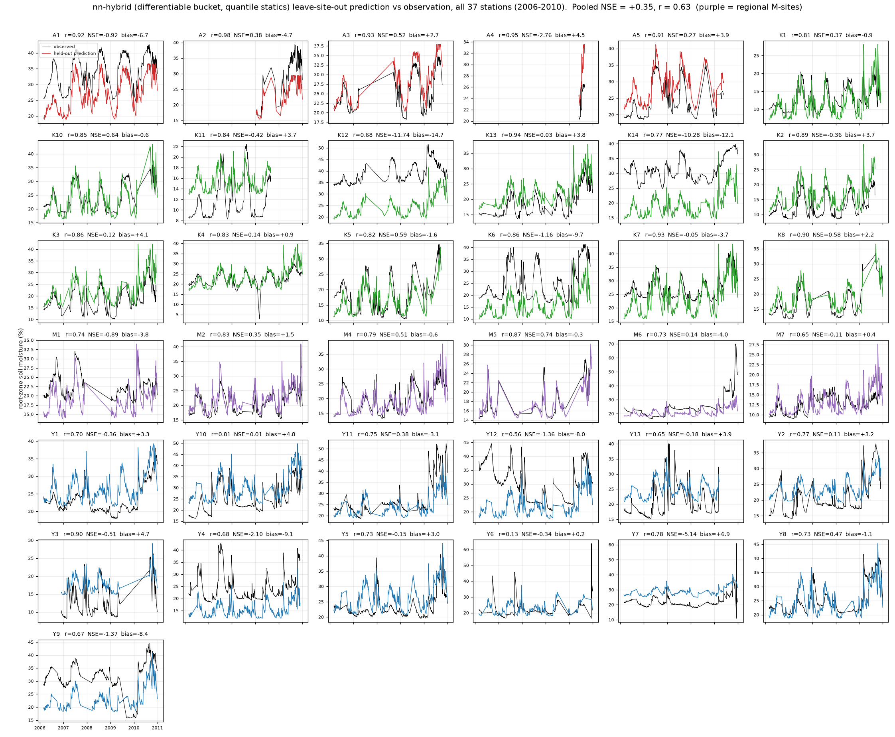

# nn-hybrid: the differentiable bucket — best blocked transfer in the repo

<!-- NAV -->
[← nn-transformer](nn_transformer.md) · [Index](../README.md) · [nn-stack →](nn_stack.md)
<!-- /NAV -->

Source: [`../../emt/nn/hybrid.py`](../../emt/nn/hybrid.py) ·
figures: [`../plot_nn_results.py`](../plot_nn_results.py),
[`../plot_nn_per_station.py`](../plot_nn_per_station.py)

[model7](model7.md)'s bucket recurrence rewritten in torch — bit-identical to
the numba loop — and run for every station over the full 2005–2010 forcing
panel, with a small MLP mapping the station statics (soil, terrain, aridity)
to per-station **deviations** of the five bucket parameters from a learned
global set, sigmoid-bounded to model7's calibration ranges::

    θᵢ = lo + (hi − lo)·σ( g + MLP(staticsᵢ) )        θ = (smax, α, k, θr, Δθ)
    Sᵢ' = clip(Sᵢ + P − PET·min(1, Sᵢ/(αᵢ smaxᵢ)) − kᵢSᵢ, 0, smaxᵢ)
    vwcᵢ = θrᵢ + Δθᵢ·Sᵢ/smaxᵢ  (+ a jointly-trained static offset head)

The deviation MLP's last layer is zero-initialised: at step 0 this **is**
model7, and every departure must earn its place on a station-grouped
validation split. Soil can now change capacity, ET stress and recession
*inside the physics* — where [model8](model8.md) can only shift the readout —
while the water balance stays enforced. Training is full-batch (one forward
pass simulates the whole panel; 0.26 s/step on CPU).

## Results — per-site and blocked

| 37 stations, 2006–2010 | station: pooled / >0 / median | block: pooled / blk-median / >0 |
|---|---|---|
| z-score statics | +0.352 / 19 / +0.02 | +0.244 / +0.03 / 5 |
| **quantile statics (recommended)** | +0.346 / 18 / −0.05 | **+0.354 / +0.30 / 7** |
| quantile + stratified weights | +0.376 / 17 / −0.19 | +0.249 / +0.22 / 5 |
| model8 (weighted, shipped) | +0.408 / 20 / +0.13 | +0.322 / +0.25 / 7 |

**The preprocessing was the lever.** A z-score fitted on 37 station rows lets
single outliers set a column's scale (soil_bdw 3.8σ, elevation 3.2σ);
rank-normalising the statics (quantile → Gaussian) is the entire blocked gain
(+0.24 → **+0.35**) and makes this the **first model in the repo to beat
model8 on blocked transfer** — the honest test for a national product.
model8's stratified weights are redundant under it (they compensate for the
same outlier problem at the loss instead of the input) and hurt blocked
ADELONG (−1.07 vs +0.34). **M7 — the station every model 1–10 fails at
NSE −13 to −26 — comes to −0.11 station-out** (bias +0.4 pp). The fitted
per-station parameters remain physical (smax 220–310 mm, α > 1 as in model7).

**The SMIPS level anchor (`--anchor`).** The residual error is per-station
level, and level at an unseen site needs an *observation*, not another proxy.
Adding each site's SMIPS climatological mean as a static (independent of
OzNet, so leakage-safe) gives station-out **+0.387 pooled, 21/37 positive
(the most of any single model in the repo), median +0.06, median |bias| 3.17**
against +0.346 / 18 / −0.05 without it. Under blocked validation it is a
wash pooled (+0.339 vs +0.354) — the SMIPS site-mean bias structure differs
by district (within-aridity-tercile correlation with the true site mean is
0.38–0.61, pooled only 0.34), so the learned correction transfers partially.
Both variants earn ensemble seats ([nn-stack](nn_stack.md)).


Held-out series for every station — compare the same figure on the
[model8 page](model8.md); the failures that remain (K12, K14, Y4) run
parallel to the observations at a constant offset:



## Reproduce

```bash
PYTHONPATH=. python -m emt.nn.hybrid cv --design station --loss nse --scale quantile --workers 12
PYTHONPATH=. python -m emt.nn.hybrid cv --design block   --loss nse --scale quantile --workers 5
```
