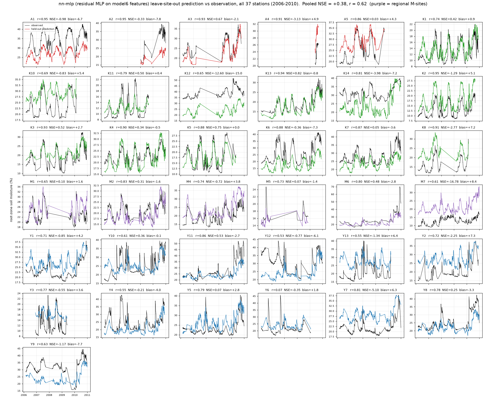

# nn-mlp: a neural network on model6's features

<!-- NAV -->
[← model10 · The hybrid](model10.md) · [Index](../README.md) · [nn-transformer →](nn_transformer.md)
<!-- /NAV -->

Source: [`../../emt/nn/model.py`](../../emt/nn/model.py) ·
[`../../emt/nn/mlp.py`](../../emt/nn/mlp.py) ·
package README [`../../emt/nn/README.md`](../../emt/nn/README.md)

The first model of the **neural-network track**: a residual MLP
(pre-norm blocks, SiLU, dropout) on [model6](model6.md)'s exact feature set —
SMIPS + lookback climatology, 30 m terrain, SLGA soil, antecedent SILO
meteorology — so any difference from model6 is the estimator, nothing else.
Trained with AdamW, a one-cycle LR schedule, gradient clipping, bf16, seed
ensembling, and early stopping on a **station-grouped** validation split (the
net can read station identity off the static covariates and memorise the
station mean; train loss collapses ~20× faster than grouped validation
improves, so stopping on random rows would stop on memorisation).

The loss is selectable: MSE, Huber, or **NSE\*** — the per-station
variance-normalised squared error of Kratzert et al. (2019),
``err² / (σ_station + ε)²``. Pooled NSE is a rescaled MSE with the same
optimum; the per-station form is the one that changes what is learned, and it
lifts the low-variance dry sites to parity at no pooled cost.

## Results — leave-station-out (37 stations, 2006–2010)

The same-features ladder, so the estimator is the only variable: the
[model1 Random Forest](model1.md) baseline scored pooled **+0.15** on this
feature set and [model6](model6.md)'s tuned boosting **+0.38**; the MLP's job
was to find where a net sits between them.

| configuration | pooled NSE | stations NSE>0 | median stn NSE | median r |
|---|---|---|---|---|
| model1 · Random Forest (baseline, same features) | +0.15 | | | |
| MSE loss, z-score | +0.303 | 14/37 | −0.48 | 0.77 |
| NSE\* loss, z-score | +0.329 | 12/37 | −0.49 | 0.78 |
| + log1p on heavy tails | +0.288 | 15/37 | −0.35 | 0.78 |
| **+ static noise 0.3σ (recommended)** | **+0.379** | **17/37** | **−0.33** | 0.79 |
| + 4-dim static bottleneck | +0.400 | 15/37 | −0.41 | 0.75 |
| model6 (boosting, same features) | +0.38 | 16/36 | | 0.81 |

**The lever is noise on the static columns.** Eleven of the 25 features
(terrain + soil) are constant within a station — a 37-row lookup table through
which the net memorises the station mean. Gaussian noise at 0.3σ on those
columns (dynamic columns stay at 0.05σ) takes the model from +0.33 to +0.38
and 12 → 17 stations positive. The bottleneck variant buys the best pooled
number by fitting the big clusters at the isolated M-sites' expense (M2 +0.31
→ −0.52) — the wrong trade for a national product, documented and not
recommended. Blocked validation was not run for this model; the track's
blocked story is on the [nn-hybrid](nn_hybrid.md) page.

The MLP reaches parity with model6 on identical inputs and rediscovers the
handout's central diagnosis: median per-station r ≈ 0.78 (dynamics fine),
~60 % of station MSE pure level offset; an oracle per-station de-bias lifts
the median station NSE to ≈ +0.5 with 35/37 positive.



## Reproduce

```bash
PYTHONPATH=. python -m emt.nn cv --design station --loss nse --workers 8
```
