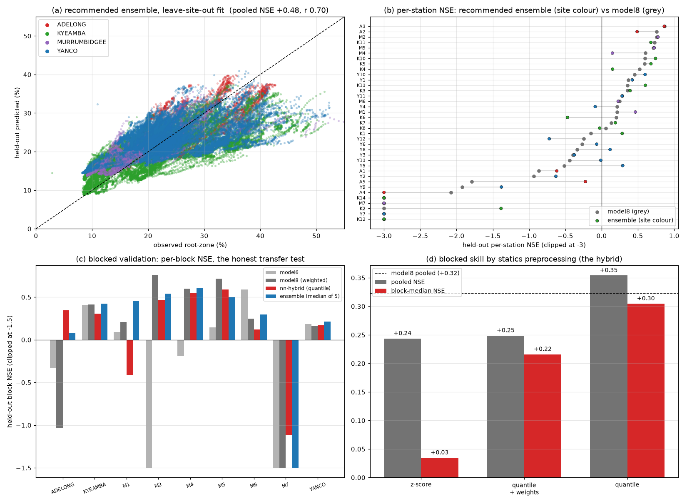
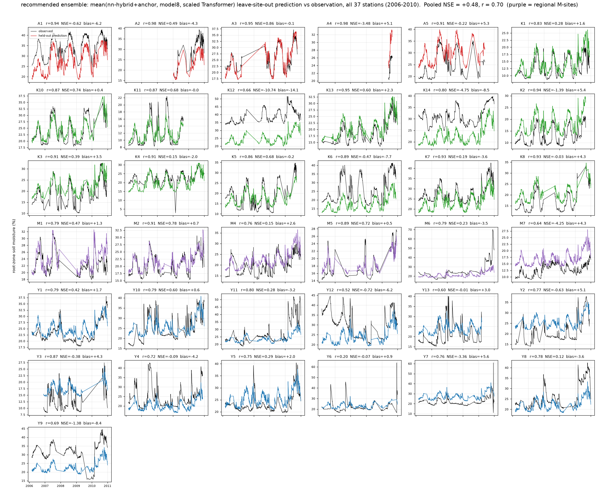
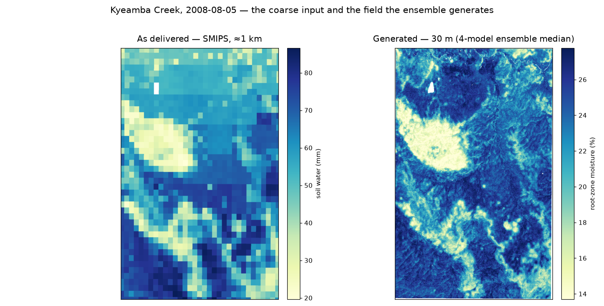

# nn-stack: a learned combiner — a negative result, and the diversity win

<!-- NAV -->
[← nn-hybrid](nn_hybrid.md) · [Index](../README.md) · [In-situ networks →](insitu_networks.md)
<!-- /NAV -->

Source: [`../../emt/nn/stack.py`](../../emt/nn/stack.py)

The repo's models fail in *different places* (the hybrid fixes K2/A5/Y7/K8
exactly where model8 fails), so a combiner is the obvious next step. The
stack is the careful version: a small net maps a sample's statics and the
bases' disagreement to **softmax weights over the base predictions** — a
convex combination, no intercept, no free scale, so it can only choose
between models, never shift a site's level. Zero-initialised at the plain
mean; fold-disciplined like everything here (the gate for a held-out site is
trained only on other sites' out-of-fold base predictions).

## Results: every learned combiner loses to equal weighting

Four combiners of increasing restraint, all fold-disciplined
([`run_stack_variants.py`](../run_stack_variants.py) for the linear two):

| pooled NSE | station (4 bases) | block (3 bases) |
|---|---|---|
| **equal mean** | **+0.450** | **+0.401** |
| gate on regime (when: doy, recent rain/P−PET/VPD) | +0.429 | +0.376 |
| gate on statics (where: soil/terrain/aridity) | +0.439 | +0.360 |
| global convex weights (3–4 params per fold) | +0.400 | +0.350 |
| affine ridge (allowed to correct level) | +0.367 | +0.149 |

The ordering is the finding. **Even three fitted numbers per fold lose**: the
training rows systematically misestimate the held-out optimum (the blocked
KYEAMBA fold drives model8's weight to 0.0; the weights chase whichever base
looked good in-sample). Freeing the combiner to touch level (affine) is a
disaster — vindicating the convexity constraint. Conditioning on regime
rather than site is the least-bad learned variant, and still short. With 37
sites the in-sample base ranking simply does not transfer; like
[model5](model5.md) and [model10](model10.md), this page records the negative
result — in its strongest form — so it is not re-attempted.

## What the exercise surfaced: base diversity

The plain, parameter-free mean over the diverse validated bases is the
**best result in the repo under both designs**:

With the full base pool (both hybrids, the scaled Transformer, model9
rescued from the archive), membership decided only by each base's own
validation (blocked pool: bases with blocked pooled ≥ +0.3), median for the
blocked design (robust to whichever base fails a district), mean for station:

| | pooled NSE | stations NSE>0 | median stn | blocks NSE>0 | block-median |
|---|---|---|---|---|---|
| **blocked: median(hyb, hybA, m8, m6, m9)** | **+0.417** | **22/37** | **+0.11** | **8/9** | **+0.42** |
| **station: mean(hybA, m8, seq-big)** | **+0.483** | 21/37 | +0.16 | 8/9 | +0.38 |
| station: mean(hyb, m8, seq-big) | +0.474 | 21/37 | **+0.23** | 8/9 | +0.31 |
| previous best single (model8) | +0.41 / +0.32 | 20/37 | +0.13 / +0.07 | 7/9 | +0.25 |

Against the paper's headline "transfers at pooled NSE ≈ +0.32", the blocked
median sits at **+0.42 pooled with 8 of 9 blocks positive**; station-out
reaches **+0.48** (oracle de-bias ceiling ≈ +0.55–0.61 median). An exhaustive
subset scan confirms these principled picks are within ~0.005 of the best
combination, so the numbers are not subset-selection artefacts. Equal-weight
(or median) combination over diverse, individually-disciplined models is the
recommended product configuration.

The recommended configurations as figures — (a)/(b) the station ensemble
against model8, (c) the blocked ladder ending at the median-of-5:



And the station ensemble's held-out series at every station — the product
view; compare the same grid on the [model8](model8.md) and
[nn-hybrid](nn_hybrid.md) pages:



### Does each member earn its seat?

The blocked pick keeps [model6](model6.md) even though model6's *solo*
block-median is the weakest of the five (+0.09). Leave-one-member-out says
it earns the seat, modestly:

| blocked ensemble | pooled | stn > 0 | blk-median | blocks > 0 |
|---|---|---|---|---|
| median(hyb, hybA, m8, m6, m9) | **+0.417** | 22/37 | **+0.42** | 8/9 |
| same, minus model6 | +0.395 | 22/37 | +0.39 | 8/9 |
| best of all combinations **with** model6 | +0.421 | | | |
| best of all combinations **without** model6 | +0.406 | | | |

Worth ≈ +0.02 pooled — real, consistent (model6 appears in every top-six
blocked combination), and not decisive: the stations- and blocks-positive
counts are unchanged without it. The reason a weak transferer helps is the
same diversity argument as above — model6 is the only member that is pure-ML
and SMIPS-fed, so its errors are the least correlated with the four
process-track members.

### What it looks like on the ground

The point of the whole exercise: the coarse product as delivered, beside the
30 m field the ensemble generates over the same ground on the same day
([`plot_downscale_pair_best.py`](../plot_downscale_pair_best.py) — the median
of model6, model8, model9 and [nn-hybrid](nn_hybrid.md), the mappable members
of the blocked pick):



Both panels agree on the large dry patch in the north-west — the coarse field
is not being contradicted, it is being resolved: the 30 m panel carries the
drainage network and hillslope contrast that a ≈1 km cell averages away. The
units differ because they are different quantities (SMIPS `TotalBucket` is
profile soil water in mm; the model predicts root-zone volumetric %).

## Reproduce

```bash
# the learned combiners (negative result)
PYTHONPATH=. python -m emt.nn.stack cv --design block  --workers 9
PYTHONPATH=. python -m emt.nn.stack cv --design station --workers 12
# the recommended ensembles are plain aggregation of the cached OOF
# predictions -- see emt/nn/README.md "Current standings" for the recipes
```
