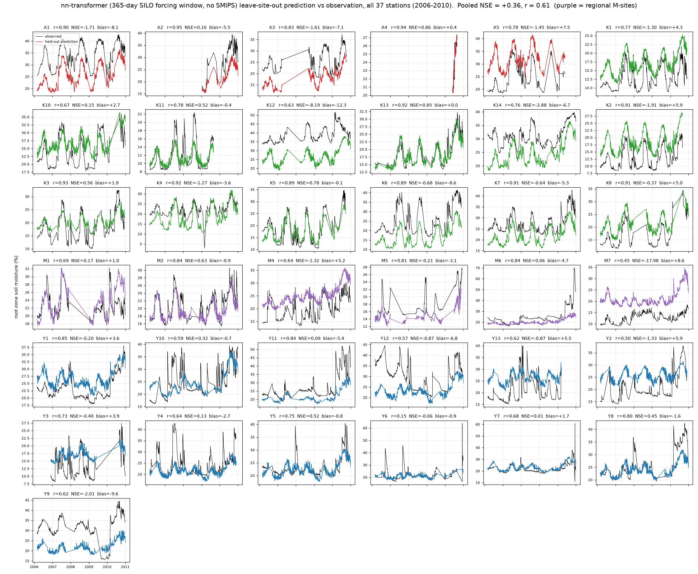

# nn-transformer: a sequence model over the SILO forcing

<!-- NAV -->
[← nn-mlp](nn_mlp.md) · [Index](../README.md) · [nn-hybrid →](nn_hybrid.md)
<!-- /NAV -->

Source: [`../../emt/nn/seq.py`](../../emt/nn/seq.py)

The neural analogue of the [model7](model7.md)/[model8](model8.md) bucket:
**no SMIPS** — the inputs are the previous 365 days of SILO rain / PET / VPD
at the station (plus day-of-year) and the station statics, so like the
process track it runs for any date. A static token plus 365 forcing tokens
pass through a pre-norm Transformer encoder (d=64, 3 layers, 4 heads, learned
positions); the readout is the target-day token. Windows are gathered on the
fly from a per-station forcing panel resident on the GPU, so nothing of size
samples × 365 is ever materialised; training uses the same NSE\* loss,
grouped early stopping and seed ensemble as [nn-mlp](nn_mlp.md).

## Results — leave-station-out (37 stations, 2006–2010)

| | nn-transformer | nn-mlp (needs SMIPS) | model8 (same inputs) |
|---|---|---|---|
| pooled NSE / r | +0.355 / 0.61 | +0.379 / 0.62 | +0.408 / 0.64 |
| stations NSE>0 | 15/37 | 17/37 | 20/37 |
| median stn NSE | −0.64 | −0.33 | +0.13 |
| median stn r | 0.77 | 0.79 | 0.82 |

Three findings. **The SMIPS product is not necessary to reach ~+0.36**: on
model8's inputs the untuned Transformer matches the SMIPS-fed MLP. **The
forcing history carries level information**: it repairs several of the
network's worst level outliers (Y7 −7.5 → +0.01, A4 → +0.86, K12 −12.5 →
−8.2, K8 → −0.4) — evidence that integrated storage anchors absolute level
better than instantaneous covariates. But **a learned water balance drifts
where an enforced one cannot**: the gains are given back elsewhere (A3, K1,
K4; 17 wins / 15 losses against the MLP), leaving it short of model8. That
diagnosis — keep the enforced bucket, learn only its parameters — is exactly
[nn-hybrid](nn_hybrid.md).



## Reproduce

```bash
PYTHONPATH=. python -m emt.nn.seq cv --design station --loss nse --workers 6 \
    --epochs 60 --patience 10 --n_ensemble 2 --batch_size 512
```

(~4.5 s/epoch at batch 256 on the RTX 5090; 6 folds fit in parallel on 32 GB.)
