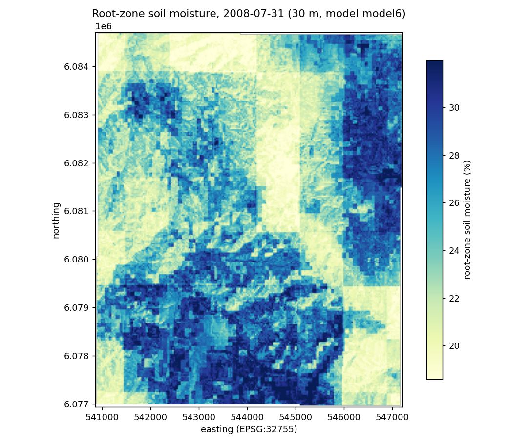

# `predict.py`: the clone-and-run inference tool

<!-- NAV -->
[← Downscaling to 30 m](downscale.py.md) · [Index](../README.md)
<!-- /NAV -->

Source: [`../../emt/predict.py`](../../emt/predict.py)

The shipped entry point that turns the trained model into a 30 m map for **any**
Australian area and day, without retraining. Where [`downscale.py`](downscale.py.md)
is the model-agnostic engine (you hand it a fitted model + assembled
`extra_layers`), `predict.py` is the batteries-included wrapper: it loads the
pre-trained model committed to the repo (`data/models/model6.joblib`), fetches
**every** covariate the model needs for the AOI/day, and predicts per pixel.

| Interface | Call |
|---|---|
| Python | `predict(bbox, day, model=None, model_name="model6") -> xr.Dataset` |
| CLI | `python -m emt.predict --bbox W S E N --date YYYY-MM-DD -o map.tif` |

## What it does

For a bounding box (EPSG:4326) and a day it assembles the full feature stack — in
the model's exact `FEATURES` order — and predicts:

1. **30 m terrain** ([`covariates.py`](covariates.py.md)) — the target grid.
2. **SMIPS lookback** ([`smips.smips_lookback_day`](../../emt/smips.py)) — the
   past 7/30/365-day means + anomaly, as of the day.
3. **SLGA soil** ([`slga.soil_covariates`](slga.py.md)) — the static soil stack.
4. **SILO antecedent** ([`antecedent.antecedent_grid`](../../emt/antecedent.py)) —
   the day's gridded trailing-window weather.

Each raster is reprojected onto the 30 m grid, the features are stacked in
`FEATURES` order, and the model predicts every pixel with complete covariates.
Every window is strictly **backward-looking** (the same leak-free features the
model was trained on — see
[Evaluation correction](../README.md#evaluation-correction)). In-situ
observations are never an input.

**Returns** an `xr.Dataset` on the 30 m grid with `sm_pred` (root-zone soil
moisture, %). By default it also **saves** the GeoTIFF and a quick-look PNG into
that AOI's PaddockTS query directory (`query.out_dir`, alongside its cached
covariates), recording the paths in `ds.attrs['output_tif' / 'output_png']`
(disable with `save=False` / `plot=False`).

## Python

```python
from emt.predict import predict
ds = predict(bbox=(147.30, -35.52, 147.62, -35.10), day="2008-07-31")
ds["sm_pred"]                          # xr.DataArray, 30 m soil moisture (%)
ds["sm_pred"].rio.to_raster("soil_moisture_30m.tif")
```

Pass your own fitted estimator via `model=` to bypass the shipped one (e.g. a
leave-region-out model); otherwise it loads `model_name` from `data/models/`.

## CLI

```bash
PYTHONPATH=. python -m emt.predict \
    --bbox 147.30 -35.52 147.62 -35.10 \
    --date 2008-07-31
# writes soil_moisture_2008-07-31.tif + .png into the AOI's query dir
```

`--bbox` is `W S E N` in EPSG:4326; `--model` defaults to `model6`. The map is
saved as `soil_moisture_<date>.tif` in the AOI's PaddockTS query directory, with a
companion quick-look PNG (`plot_field`) beside it — pass `--no-plot` to skip the
PNG, or `-o PATH` to write an extra copy of the GeoTIFF wherever you like. A first
run over a new area fetches ~a year of SMIPS and SILO (a few minutes), cached under
the AOI stub for later days.

Example output (`python -m emt.predict --bbox 147.45 -35.45 147.52 -35.38 --date
2008-07-31`) — the coarse ≈1 km SMIPS resolved to 30 m terrain structure:



## Requirements

Network access, plus two free accounts in `~/.config/PaddockTS.json` (see
[Use the model](../README.md#use-the-model)): a **TERN API key** (SLGA soil) and a
**SILO email** (antecedent weather). SMIPS and the Copernicus-DEM terrain need
nothing — terrain is read anonymously from its public AWS bucket
(`AWS_NO_SIGN_REQUEST`, set by the module), so no AWS credentials are required.

## Compatibility: the shipped `model6.joblib` and newer scikit-learn

The committed artefact was pickled by an older scikit-learn and **fails to
load on 1.9.0**:

```
joblib.load("data/models/model6.joblib")
ModuleNotFoundError: No module named '_loss'
```

Boosting models pickle references to scikit-learn's internal Cython modules,
whose import paths move between releases. The process-track artefacts are
unaffected (`model8.joblib`, `model9.joblib` load fine — a `BucketEstimator`
is plain Python, numpy and a handful of fitted coefficients), and so is the
neural track, whose checkpoints are tensors plus dataclasses
(`data/models/nn_hybrid_q.pt`).

Until the artefact is re-pickled, refit it once from the **cached feature
table** — seconds, and no downloads, because every column is already in
`data/model6_features_2006_2010.csv`:

```python
import pandas as pd
from emt.model6 import model as m6
from emt.persist import fit_cached
est = fit_cached(m6, pd.read_csv("data/model6_features_2006_2010.csv"), "model6_sk19")
predict(bbox=..., day=..., model=est)          # pass it in via model=
```

## Which tool for which model

`predict.py` wraps the *feature-based* ML track. The process and neural tracks
have their own entry points, and they differ in what they need
([three ways to make a map](downscale.py.md#three-ways-to-make-a-map)):

| tool | model | needs SMIPS? | dates |
|---|---|---|---|
| `emt.predict` (this page) | model6 (and any `downscale()`-compatible fit) | **yes** | any day SMIPS covers |
| [`emt.model8.predict`](model8.md#run-it-for-any-date) | model7–9 | no | any date, point series or map |
| [`emt.nn.spatial`](nn_hybrid.md#30-m-maps) | nn-hybrid | no | any date; many dates per run |

Note that the branch's best-scoring configuration is an **ensemble** of these
(blocked NSE +0.42 — see [nn-stack](nn_stack.md)), and there is no single-call
wrapper for it yet: the gallery script
[`plot_downscale_gallery_best.py`](../plot_downscale_gallery_best.py) shows how
the members are combined on a grid.

## Caveat: Murrumbidgee-trained, unvalidated elsewhere

The shipped model is trained and validated only in the Murrumbidgee catchment. A
run anywhere else still produces a field, but with an uncorrected per-site level
bias and no out-of-region validation (see the
[skill caveats](../README.md#the-model)). Off-catchment output is **indicative,
not calibrated** — the tool prints this warning on every run.

---
<!-- NAV -->
[← Downscaling to 30 m](downscale.py.md) · [Index](../README.md)
<!-- /NAV -->
