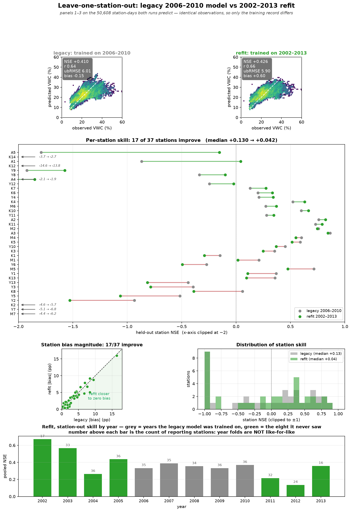
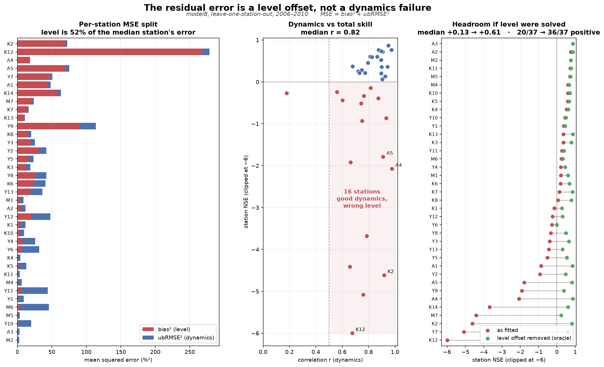

# Data quality: what the 25-year record contains

<!-- NAV -->
[← In-situ networks](insitu_networks.md) · [Index](../README.md) · [Downscaling to 30 m →](downscale.py.md)
<!-- /NAV -->

Source: [`../../emt/insitu/qc.py`](../../emt/insitu/qc.py) ·
[`../validate_qc.py`](../validate_qc.py) · [`../run_extended_cv.py`](../run_extended_cv.py)

Extending OzNet from 2006–2010 to 2001–2025 was meant to buy regime variety.
It did — and it also revealed that **the wider record is not usable as
delivered**. This page records what is wrong with it, how much survives, and
the two rules that were tried and rejected.

## 1. Logger sentinels

The contract check ([`insitu/base.py`](../../emt/insitu/base.py)) refused the
extended table on sight:

```
ValueError: 2770 rows outside 0.0-100.0 % (min 0.00, max 65535.00)
```

**65535 is 2¹⁶−1** — a logger sentinel, not a measurement. Others sit at 43696,
38239 and 21870: raw counts leaking through. In total 2,979 rows (1.85 %)
violate a 0–65 % volumetric range.

Two properties matter. **None of it is in 2006–2010** — the window every
published result used is clean, which is why this was never seen. And it is
concentrated in the recent years, rising steadily: 660 rows in 2021, 825 in
2022, 1,161 in 2023. The existing loader masked `df <= -99`, a lower bound
only, so an upper sentinel passed straight through.

These are dropped. They are the only thing dropped.

## 2. Two detectors that were tried and rejected

**A robust-z outlier rule.** The obvious next step — flag anything more than
five robust deviations from a 31-day rolling median — flagged 3,412 rows,
2.18 % of even the "clean" 2006–2010 window. Before acting on that, it was
validated against SILO rain, and it failed:

| | flagged | with ≥5 mm/3 d | vs baseline |
|---|---|---|---|
| baseline (any day) | — | 21.9 % | 1.00 |
| robust-z outliers | 3,412 | 37.4 % | **1.71** |

65.6 % of its catch sat *above* the local median, and those wet excursions
carried a median 5.3 mm of preceding rain against 0.0 mm for the dry ones. **A
detector that fires when it rains is detecting weather.** Dropping its catch
would have deleted real wetting events and biased the training target dry —
the exact failure the project is trying to remove.

**A persistence test.** Replacing it with a physical discriminator — a real
wetting event holds for days, a glitch reverts within one — cut the catch by
92 %, to 264 rows. But the survivors were still **1.54×** rain-enriched. A
one-day wet excursion that drains by the next day is ordinary in a shallow or
sandy profile.

So spike detection **does not drive deletion here**. The rule is retained as a
reported flag, and [`validate_qc.py`](../validate_qc.py) re-runs the
enrichment test so the claim stays falsifiable.

## 3. The finding that matters: calibration discontinuities

With sentinels removed, model8 was trained on all 25 years. Skill is positive
through 2013 and then collapses:

| era | pooled NSE | bias |
|---|---|---|
| 2002–2013 | +0.13 … +0.34 | within ±2 pp |
| 2017–2019 | −1.29 … −2.13 | **−6.6 … −7.2 pp** |
| 2023–2025 | −0.27 … −0.35 | r goes **negative** |

A model does not anti-correlate with reality. Testing the observations against
rainfall — an independent reference the sensors cannot influence — shows why.
Across the 19 stations reporting in both eras, **18 read wetter in the later
record**, and the shift is not explained by rain:

| station | early mean | late mean | Δ | rain |
|---|---|---|---|---|
| **Y6** | 25.9 % | 46.0 % | **+20.1 pp** | 322 → 359 mm (+11 %) |
| **Y13** | 21.8 % | 35.0 % | +13.1 pp | 343 → 469 mm |
| **Y4** | 27.8 % | 34.4 % | +6.6 pp | 366 → 376 mm (+3 %) |

The clearest single number: **2019** was the Tinderbox Drought, 217 mm of
rain, among the driest years the Murrumbidgee has recorded — and the network
reports the **wettest** mean soil moisture in the entire 25-year archive,
15.1 % per 100 mm of rain against ~5 in the 2000s. Soil moisture cannot rise
while rainfall stays flat.

A rain-adjusted step scan locates it as **per-station discontinuities, not one
network-wide event**: 15 stations carry a significant step, scattered across
the record and running in both directions (Y6 +17.8 pp at 2016-02, Y13 +10.9
at 2013-04, K12 −9.5 as early as 2005-11). Pre-2013 steps skew negative,
post-2013 strongly positive. This is sensor replacement and recalibration at
individual sites — routine in a long in-situ record, and invisible to any
per-row filter, because every affected value is individually plausible.

## 4. What is usable

The homogeneous era is **2002–2013**, and it is a clear gain:

| | rows | pooled | block-median | blocks>0 | station-median |
|---|---|---|---|---|---|
| legacy 2006–2010 | 47,786 | +0.322 | +0.249 | 7/9 | +0.07 |
| **extended 2002–2013** | **101,524** | +0.316 | +0.243 | 7/9 | **+0.160** |
| full 2001–2025 | 157,364 | +0.263 | +0.254 | 5/9 | +0.023 |

Twice the data and twelve years instead of five, with transfer skill held and
**station-level skill more than doubled**. The added years bring the
Millennium Drought and the 2010–12 La Niña — the regime variety the
five-year window lacked. Per-year bias stays inside ±2 pp throughout.

### The full validation ladder

Run across all four harnesses, the extended era matches or beats the legacy
window everywhere, and the gain grows with the strictness of the test:

| harness | legacy 2006–2010 | extended 2002–2013 | station-median (legacy → ext) |
|---|---|---|---|
| station-out (interpolation) | +0.408 | **+0.431** | +0.13 → +0.199 |
| blocked (transfer) | +0.322 | +0.316 | +0.07 → +0.160 |
| **block × year** (worst case) | +0.273 | **+0.304** | −0.01 → +0.151 |

> **Read the station-median column with care.** Each row scores the two models
> on *their own* periods — 5 years against 12 — so those figures confound the
> model with the sample. The like-for-like comparison is below, and it does
> not say the same thing.

### Like-for-like: same observations, both models

Scoring both station-out runs on the **50,608 station-days they both predict**
(inner join on station and time; target values are bit-identical across the
two files) isolates the training record as the only difference:

| matched subset | legacy | refit | |
|---|---|---|---|
| pooled NSE | +0.410 | **+0.426** | |
| r | 0.64 | **0.66** | |
| ubRMSE | 6.01 | **5.90** | |
| bias | **−0.15** | +0.60 | refit runs wetter |
| **median station NSE** | **+0.130** | +0.042 | **refit is worse** |
| stations improved | — | 17 / 37 | |

**The refit is better in aggregate and worse per station.** Pooled skill,
correlation and ubRMSE all improve, but the median *station* loses skill and
barely half the stations gain. The naive +0.199 figure in the table above was
a property of the larger sample, not of the model.

That is a real trade, not a defect: the legacy model is specialised to the
five years it was fitted on, and the refit gives up some of that in-period
per-site sharpness for a calibration that holds across regimes. The evidence
for the other side of the trade is the block × year collapse — 0.049 for the
legacy model against **0.012** for the refit. Which matters depends on the
use: a national product over unseen years and districts wants the refit; a
2006–2010 Murrumbidgee reanalysis is better served by the legacy fit.



Six stations fall below the panel's −2 clip and are annotated with their true
values rather than dropped — K12 is catastrophic in both (−14.6 → −13.8) and
Y7, M7 and K2 degrade further under the refit.

The number that matters is the **collapse from blocked to block × year**: the
legacy model loses 0.049 NSE when the test year is also withheld, the extended
model only **0.012**. Training across twelve years spanning drought and two La
Niña events makes the model substantially robust to a regime it has never
seen — which is precisely the property a national product needs and the
five-year window could not supply. At station level the strict harness moves
from **−0.01 to +0.151**: under the legacy record the median station was worse
than its own long-term mean, and it no longer is.

### Recalibration

Refitting on the longer, drier record moves the water balance coherently:

| parameter | shipped | 2002–2013 | |
|---|---|---|---|
| `smax` | 179.4 mm | 158.0 mm | −11.9 % |
| `alpha` | 1.167 | 1.313 | +12.5 % |
| `k` | 0.0070 | 0.0055 | −21.6 % |
| `theta_r` | 17.73 % | 18.22 % | +2.8 % |
| `dtheta` | 16.87 % | 14.95 % | −11.4 % |

A smaller, slower-draining bucket with a narrower readout range, and AET
reaching potential only at a higher storage fraction — what seeing more
drought should do to a water balance. Same 14 parameters; no structural
change. Fitted artifact: `data/models/model8_ext2002_2013.joblib`.

A side benefit: the aridity static is computed over the same window the model
trains on, so the training/inference window mismatch tracked on the
`aridity-reference-window` branch does not arise — it is fixed by
construction.

**M3** is excluded (1,079 rows): it has coordinates but no forcing or statics,
and has been silently absent from every result to date.

## 5. Reading year folds

Station availability is not constant — **34 stations clear 200 days in 2006,
10 in 2024**. A late-record year fold is a smaller and differently-composed
sample, so a skill change there may be the network shrinking rather than the
model failing. Per-year station counts are printed beside per-year skill, and
no year-on-year comparison should be read without them.

```bash
PYTHONPATH=. python handout/validate_qc.py
PYTHONPATH=. python handout/run_extended_cv.py block --years=2002-2013
```

## 6. What the residual error actually is

The station-out comparison left six stations below −2 NSE under every
configuration from model7 to model10, K12 at −14.6. The natural reading is
that the model fails there. It does not — **those stations carry the lowest
absolute errors in the network.** A4 has the best ubRMSE of all 37 (0.91 pp)
at NSE −2.08; the six worst-NSE stations have a median ubRMSE of 1.86 against
2.62 for everyone else.

NSE is variance-normalised and charges the full cost of a constant offset, so
splitting MSE into its two parts separates the two failures:

    MSE = bias² + ubRMSE²
          level   dynamics



| | |
|---|---|
| median share of MSE that is pure **level** | **52 %** |
| stations where level is >80 % of MSE | 10 / 37 |
| median station correlation r (**dynamics**) | **0.82** |
| stations with r > 0.5 but NSE < 0 | **16** |

**The process model has largely solved the dynamics and is failing on level.**
It tracks the shape of the wetting and drying curve at r = 0.82 across the
network, and then places that curve at the wrong absolute height.

Removing each station's mean offset — an **oracle**, using held-out truth, so
an upper bound and not an achievable result — gives:

| | as fitted | level solved |
|---|---|---|
| median station NSE | +0.130 | **+0.613** |
| stations NSE > 0 | 20 / 37 | **36 / 37** |
| K12 | −14.57 | **+0.41** |

That is the whole remaining headroom of the project, and it sits in one place.
Every configuration from model7 to model10 has been an attempt at this level
problem through the ridge offset stage — soil, terrain, aridity, pedotransfer
limits, AWC capacity — and each bought a few hundredths. The decomposition
explains why the gains were small and where a large one would have to come
from.

The implication for direction: further work on the water balance is
mis-targeted. The lever is **anchoring the absolute level**, and the route
already identified in [`downscale.py`](downscale.py.md#future-work-mass-conservation)
— rebasing the predicted cell mean onto an *observed* coarse soil-moisture
field in % (SMAP L4 or ASCAT, both national and public) while keeping the fine
terrain structure — attacks exactly this term, using satellite data rather
than more in-situ calibration. Untested, and the single highest-value
experiment available.

## Open

Recovering 2014–2025 needs the discontinuities corrected, not filtered. The
natural route is a per-station-segment offset: model8 already fits a
ridge-regularised per-station offset, so splitting a station at a detected
break into two calibration segments fits its existing architecture. That
offset is predicted *from statics* so it can generalise to uninstrumented
sites, and statics do not change at a break — so the segment term would have
to be a training-time nuisance parameter, not part of the shipped readout.
Untested.

---
<!-- NAV -->
[← In-situ networks](insitu_networks.md) · [Index](../README.md) · [Downscaling to 30 m →](downscale.py.md)
<!-- /NAV -->
