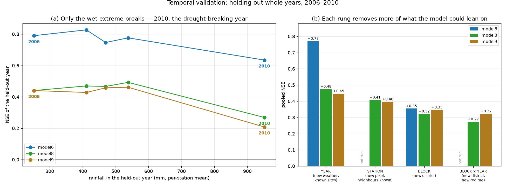

# Temporal validation — which kind of generalisation is actually hard

<!-- NAV -->
[← model9 · Pedotransfer readout](model9.md) · [Index](../README.md) · [Downscaling to 30 m →](downscale.py.md)
<!-- /NAV -->

Source: [`../run_blocked_cv.py`](../run_blocked_cv.py) (`@year` and
`@blockyear` folds) ·
figure: [`../plot_temporal_validation.py`](../plot_temporal_validation.py)

Every skill number elsewhere in this handout holds out **places**. None held out
**time** — and 2006–2010 is not five interchangeable years. It spans the tail of
the Millennium Drought and its break:

| year | rainfall (mm, per-station mean) | mean observed moisture |
|---|---|---|
| 2006 | 252 | 20.9 % |
| 2007 | 538 | 22.3 % |
| 2008 | 470 | 21.6 % |
| 2009 | 411 | 21.0 % |
| **2010** | **951** | **27.6 %** |

A **3.8× range** in annual rainfall, with 2010 wetter than the other four
combined would suggest. That matters because [model8](model8.md) and
[model9](model9.md) are sold on running forward to *any* date — 2025 included —
and every model here had seen all five years in training.

This page holds each year out whole (`@year` folds in the same harness) for
[model6](model6.md), model8 and model9 — and then holds out **place and year
together**, which turns out to be where the honest number lives.

## Results

| pooled NSE | YEAR | STATION | BLOCK | BLOCK × YEAR |
|---|---|---|---|---|
| model6 | **+0.771** | — ¹ | +0.355 | ² |
| model8 (shipped) | +0.475 | +0.408 | +0.322 | +0.273 |
| model9 | +0.447 | +0.397 | +0.347 | **+0.323** |

¹ not run — model6's station-out reference is the published 36-station figure
(+0.377), not a same-rows rerun on this table. ² model6's 44-cell block × year
run is expensive (a boosting fit per cell); see the note at the end.

Skill of each held-out year:

| year | rain | model6 NSE / bias | model8 NSE / bias | model9 NSE |
|---|---|---|---|---|
| 2006 | 252 | +0.790 / −0.31 | +0.440 / −0.75 | +0.440 |
| 2007 | 538 | +0.776 / −0.75 | +0.492 / +0.41 | +0.461 |
| 2008 | 470 | +0.747 / +1.30 | +0.466 / +0.64 | +0.458 |
| 2009 | 411 | +0.827 / +0.85 | +0.470 / +0.73 | +0.428 |
| **2010** | **951** | **+0.635 / −2.39** | **+0.269 / −2.23** | **+0.208** |



## Findings

**1 · Time is the easy axis; space is the hard one.** For the *same* model8,
pooled NSE runs +0.475 (year) → +0.408 (station) → +0.322 (block) → +0.273
(both). Holding out
a year leaves every station in training, so the model already knows each site's
*level* and only has to cope with unfamiliar weather — which is precisely the
part the bucket does well. Holding out a district removes the level information
too. **The generalisation this project actually needs is the one that scores
worst.**

**2 · Only the wet extreme breaks — and it is the same failure as in space.**
Four of the five years score within 0.05 NSE of each other for every model.
2010 collapses: model8 +0.47 → +0.27, model9 +0.46 → +0.21, model6 +0.78 →
+0.64. And it collapses *in the same direction* as the spatial failures — a
negative bias, predicting too dry, on the year that ran wetter than anything
in calibration. The driest year (2006, 252 mm) is not hard at all *here* — but
that turns out to depend on the site being known, and it reverses under the
[strict design](#the-strict-design-new-place-and-new-regime) below.

**3 · The prediction that the process track would transfer better across time
was wrong.** The reasoning was that model6 carries lookback *features* while
model8/9 carry a *state*, so the process models should ride a regime shift
better. The opposite happened: **model6 wins the year folds outright**, +0.771
against +0.475, with a median per-station NSE of +0.45 and a median |bias| of
0.47 % — its best result anywhere in this handout.

**4 · But that model6 number is not a national-product number.** Under year
folds nothing spatial is withheld, so model6's 25 features can identify each
station and learn its level directly. +0.771 is the score for *"we have a
sensor at this site and want another year of record"* — a real use case, and
the one model6 is best at. The same model scores +0.355 pooled and **+0.09
block-median** when the site is genuinely new. The harnesses reorder the two
tracks:

| harness | winner | by |
|---|---|---|
| leave-one-year-out | model6 | +0.77 vs +0.48 |
| leave-one-block-out, pooled | model6 | +0.36 vs +0.32 |
| leave-one-block-out, block-median | **model8** | +0.25 vs +0.09 |

Which is the whole argument for stating the harness beside every number.

## The strict design: new place *and* new regime

The per-year results warranted the harder experiment. **Block × year** holds out
both at once — 44 cells, and for each the model trains on rows from *neither*
that district *nor* that year, so it has seen neither the place nor the
weather regime. This is the honest floor.

The full ladder, for the same shipped model8:

| fold design | what it withholds | pooled NSE | station-median NSE |
|---|---|---|---|
| leave-one-YEAR-out | the regime | +0.475 | +0.16 |
| leave-one-STATION-out | one pixel | +0.408 | +0.13 |
| leave-one-BLOCK-out | the district | +0.322 | +0.07 |
| **BLOCK × YEAR** | **both** | **+0.273** | **−0.01** |

Monotone, and the last rung is the one that matters for the honest claim:
under the strict design the **typical station's NSE is zero** — at a new site
in an uncalibrated regime, the model is no better than someone who knew that
site's long-run average and guessed it every day. It still beats that baseline
*pooled* (+0.273), because it correctly ranks wet districts against dry ones.

**Two things this design reveals that the single-axis folds hid:**

**The dry extreme is only hard once the place is unknown too.** Under year-only
folds, 2006 (the drought's driest) scored +0.440 — no trouble at all. Under
block × year it drops to **+0.146**, nearly as bad as 2010's +0.143. With the
site's level known, an unusually dry year is easy; without it, dry and wet
extremes are equally hard.

| held-out year | rain | year-only (model8) | block × year (model8) |
|---|---|---|---|
| 2006 | 252 | +0.440 | **+0.146** |
| 2007 | 538 | +0.492 | +0.241 |
| 2008 | 470 | +0.466 | +0.255 |
| 2009 | 411 | +0.470 | +0.177 |
| 2010 | 951 | +0.269 | +0.143 |

**model9's advantage widens under strictness.** It beats model8 in *every* year
of the strict design (+0.323 vs +0.273 pooled), where under blocked folds alone
the margin was slimmer. The more you withhold, the more the physical readout
earns its place — which is an argument for it that the headline blocked numbers
understate.

**M7 is a site problem, not a regime problem.** All five worst cells are M7, in
all five years, with correlations of 0.66–0.97 — including **r = 0.97 at
M7/2006 with NSE −14.8**. Near-perfect dynamics, catastrophic level. No
weather regime explains that; it is simply a site whose level the covariates
cannot reach.

## What this does and does not establish

**It does** establish that a regime shift of this size costs roughly 0.2 NSE at
the wet end and nothing measurable elsewhere, and that model8's "any date"
claim is sound for ordinary years while optimistic for exceptionally wet ones.

**It does not** isolate time cleanly. Both tracks leak across the fold boundary
by construction: model6's 365-day lookback features on a held-out January draw
on the previous (training) December, and the process models' bucket state is
simulated *continuously* through the training years into the held-out one. So
this measures **"a year whose weather was not in the calibration"**, not "a year
in isolation". Removing that would need a buffer of a year on each side of every
fold, which on a five-year record leaves almost nothing to test.

The **block × year** design above closes most of that gap — it is the strictest
test available on this dataset, and it is the number to quote for a national
product applied to an arbitrary year.

## A note on model6's strict run

model6's block × year design needs a gradient-boosting fit per cell — 44 of
them, against the two process models' seconds-per-fit. It was launched but is
not reported here; the model6 column of the strict table is left empty rather
than filled with a figure that was not measured. The two process models are
enough to establish the ladder's shape, and model6's position on the first
three rungs is already known.

## Reproduce

```bash
PYTHONPATH=. python handout/run_blocked_cv.py m8capaw@year m9@year m6@year
PYTHONPATH=. python handout/run_blocked_cv.py m8capaw@blockyear m9@blockyear
PYTHONPATH=. python handout/plot_temporal_validation.py
```

The `@year` and `@blockyear` suffixes work on any configuration in
[`run_blocked_cv.py`](../run_blocked_cv.py), alongside `@station` and the
default block folds. Out-of-fold predictions land in
`data/model{6,8,9}_{yearcv,blockyearcv}*_predictions.csv`.

---
<!-- NAV -->
[← model9 · Pedotransfer readout](model9.md) · [Index](../README.md) · [Downscaling to 30 m →](downscale.py.md)
<!-- /NAV -->
