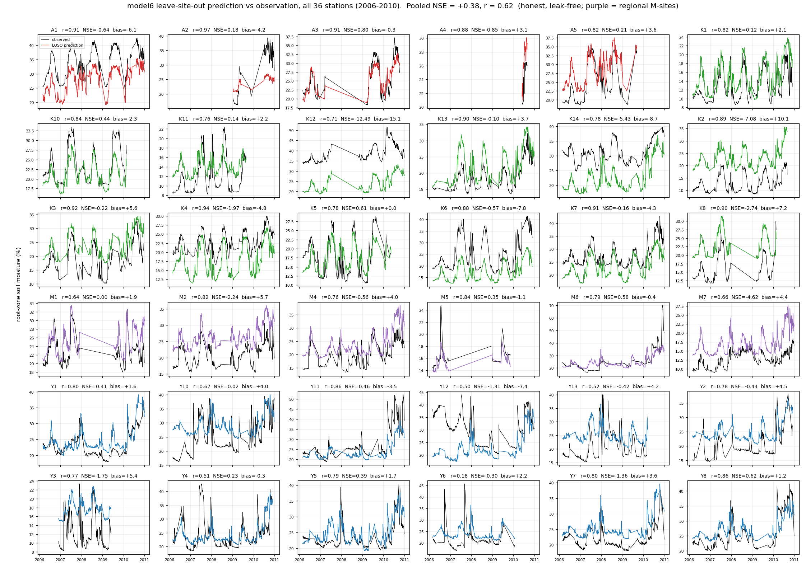
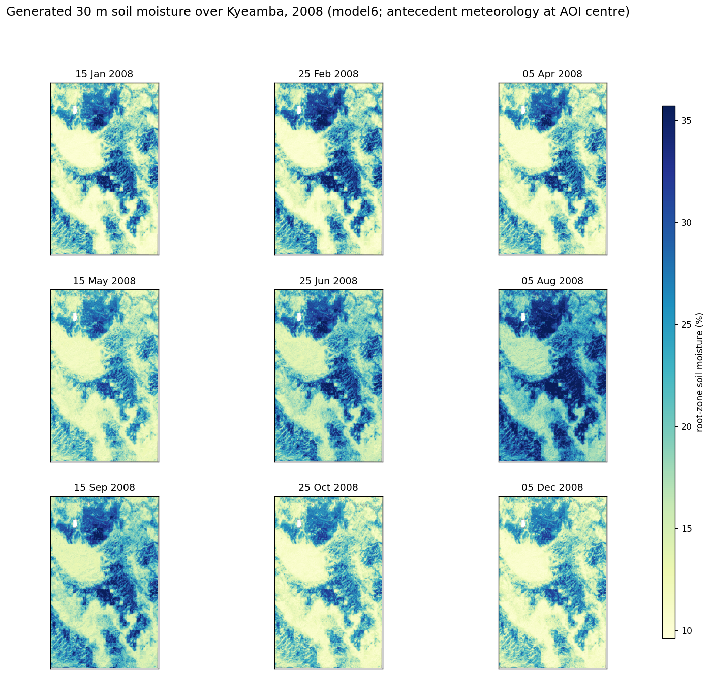

# Context and results summary — soil-moisture downscaling work to date

Date: 2026-07-25  
Repo branch: `EMT`  
Primary repo: `/Volumes/Dmitry_work/borevitz_projects/DownscalingMoistureModel`

## Project framing

The working goal is to downscale coarse Australian soil-moisture products to a
sub-property / paddock-scale product useful for land management and
ecophysiology modelling. The operational target is a 30 m daily estimate of
root-zone soil moisture, driven by public/national gridded inputs and trained
against in-situ soil-moisture observations.

The current model family uses TERN SMIPS as the coarse soil-water predictor and
learns how terrain, soil and recent meteorology redistribute moisture within the
coarse pixel. The current implementation is in the `emt/` package.

## Model development state

The model sequence developed in the handout moves from simpler statistical
baselines to the chosen model6:

1. **model1** — random-forest-style baseline using coarse SMIPS, terrain and
   seasonality.
2. **model2** — simpler linear/interpretable comparison.
3. **model3** — gradient boosting comparison.
4. **model4** — major improvement: SMIPS lookback/climatology features plus SLGA
   soil variables.
5. **model5** — soil smoothing experiment; useful diagnostic but not selected.
6. **model6** — selected model: model4 plus antecedent SILO weather features.

Model6 is selected because it retains the nationally available, leakage-safe
input design while improving held-out station skill and reducing level bias.
The handout reports approximately:

- pooled leave-site-out NSE/R²: about `0.39`
- pooled `r`: about `0.64`
- positive-NSE stations: `17/36`
- median per-station |bias|: about `3.16 %`

Relevant figures:

- 
- 
- 

## Dense soil-moisture point validation

Input CSV:

`/Volumes/Dmitry_work/borevitz_projects/Data/soilmoisture_points_coordinates.csv`

Converted/usable data summary:

- source rows: `631`
- usable point/date observations: `560`
- excluded rows: `71`, mostly missing coordinates
- unique georeferenced points: `79`
- sampling dates: `9`
- date range: `2025-04-30` to `2025-07-17`

Important caveat: the dense point data appear to represent a shallow/device-scale
measurement, while model6 was trained against OzNet-style root-zone soil
moisture. The validation is therefore an external transfer and calibration
diagnostic unless the measurement-depth mismatch is reconciled.

Dense validation output folder:

`/Volumes/Dmitry_work/borevitz_projects/model6_dense_validation_spiking`

### Stage 1 — unseen dense-point validation

The original, uncalibrated model6 was run for every dense-sampling date. The
prediction rasters were sampled at the point locations and evaluated with the
same metrics as the handout.

Pooled model6 skill against the dense point dataset:

| metric | value |
|---|---:|
| NSE / R² | `0.023` |
| Pearson r | `0.238` |
| RMSE | `6.477` |
| ubRMSE | `6.453` |
| bias | `-0.558 %` |
| n | `560` |

Per-point summary:

- positive NSE/R² points: `43/79`
- very poor NSE/R² points (≤ -1): `13/79`
- median |bias|: `2.26 %`

Point-quality rasters:

- `/Volumes/Dmitry_work/borevitz_projects/model6_dense_validation_spiking/stage1_dense_unseen_validation/rasters/point_quality_nse_r2.tif`
- `/Volumes/Dmitry_work/borevitz_projects/model6_dense_validation_spiking/stage1_dense_unseen_validation/rasters/point_quality_bias.tif`
- `/Volumes/Dmitry_work/borevitz_projects/model6_dense_validation_spiking/stage1_dense_unseen_validation/rasters/point_quality_rmse.tif`

Bias diagnostics were later corrected to use the actual model6 inputs rather
than field-CSV terrain columns. Strongest model-input associations with point
NSE/R² were:

| model input | Pearson r with point NSE/R² |
|---|---:|
| TWI | `-0.330` |
| northness | `-0.324` |
| SMIPS 365 d | `-0.318` |
| slope | `0.306` |
| soil_bdw | `0.282` |
| SMIPS anomaly | `0.264` |
| HLI | `-0.257` |

Meteorology predictors were present but weaker in point-level spatial
correlations; they now appear explicitly in the report. For example:

| antecedent input | Pearson r with point NSE/R² |
|---|---:|
| ppet_365 | `0.133` |
| rain_365_anom | `0.125` |
| rain_365 | `0.125` |
| rain_7 | `0.104` |
| vpd_30 | `0.038` |

Stage 1 figures:

- 
- 

### Stage 2 — local training-data spiking sensitivity

Two local-data spiking experiments were implemented:

1. **Spatial spiking** — hold out a target point, then add increasing numbers of
   other local points as calibration data. Strategies: nearest, terrain-similar,
   terrain-stratified and random.
2. **Temporal self-spiking** — use the first few observations at a point to
   improve later-date predictions at that same point.

The implemented Stage 2 spiking was residual calibration on top of shipped
model6, not full OzNet+local retraining. The reason was practical: the canonical
OzNet training table was not available in this checkout. A later local dense-site
model6 retrain was added separately.

Best spatial spiking results from the residual-calibration stage:

- terrain-stratified ridge residual, 40 local points:
  - median ΔNSE/R²: `+0.695`
  - median ΔRMSE: `-2.771`
- terrain-similar ridge residual, 40 local points:
  - median ΔNSE/R²: `+0.695`
  - median ΔRMSE: `-2.770`
- nearest ridge residual, 40 local points:
  - median ΔNSE/R²: `+0.678`
  - median ΔRMSE: `-2.848`

More conservative smoothed KNN residual maps were generated after the ridge map
correction extrapolated too strongly off the point support.

Stage 2 figures:

- 
- 
- 

## Local dense-site retraining

Two local products were generated after Stage 2:

1. **Smoothed KNN residual-corrected maps**  
   Folder:
   `/Volumes/Dmitry_work/borevitz_projects/model6_dense_validation_spiking/SM_comparison`

   In-sample point fit:

   - untrained NSE/R²: `0.023`
   - KNN residual-trained NSE/R²: `0.648`
   - RMSE reduced from `6.477` to `3.890`

2. **Direct local model6 retrain with larger leaf budget**  
   Folder:
   `/Volumes/Dmitry_work/borevitz_projects/model6_dense_validation_spiking/SM_comparison/model6_more_leaves_dense_points`

   Selected settings:

   - `max_leaf_nodes = 511`
   - `min_samples_leaf = 20`
   - `max_iter = 300`
   - `max_features = 0.3`

   GroupKFold, point-held-out estimate:

   - NSE/R²: `0.704`
   - r: `0.841`
   - RMSE: `3.565`
   - bias: `0.113 %`

   Final in-sample dense-site fit:

   - NSE/R²: `0.959`
   - r: `0.980`
   - RMSE: `1.320`

   Important finding: 127, 255, 511 and unlimited leaves gave effectively the
   same held-out score at fixed `min_samples_leaf`. For this dense local
   dataset, the practical limit was sample support per leaf, not the explicit
   leaf cap.

Final predicted-output figure:

## Current limitations

- Root-zone model target vs shallow dense-point device target.
- Training concentrated in the Murrumbidgee/OzNet domain.
- Absolute level bias remains important even when temporal r is reasonable.
- Terrain extremes, especially high TWI / high HLI / high northness contexts,
  appear more difficult for transfer.
- Local retrain is strong at this site but not yet validated outside this dense
  site.
- No formal uncertainty product yet.
- No explicit mass-conservation constraint ensuring that fine-scale predictions
  aggregate back to the coarse SMIPS moisture state.

## Future directions

- Rebuild the OzNet table and perform true OzNet+local retraining.
- Add more public in-situ data: ISMN, CosmOz, additional OzNet/MSMMN data,
  OzFlux/co-located flux sites where soil moisture is public, SMAP/SMOS cal/val
  networks, and state/agricultural monitoring networks where licensing permits.
- Harmonise depth, sensor type and time-of-day.
- Create separate surface and root-zone targets or a depth-transfer model.
- Add optical/thermal/SAR inputs where useful, e.g. Sentinel-1, Sentinel-2,
  Landsat/MODIS LST/NDVI/SWIR water indices.
- Develop uncertainty maps and active-learning guidance for where new local
  sensors would be most valuable.
- Consider hybrid data-driven + physics-constrained models.

## Human fill-in flags

- Confirm the actual measurement depth and calibration equation for the dense
  point device.
- Decide whether the local dense-site retrain should be framed as a separate
  shallow-device product or as a calibration layer on top of the root-zone model.
- Confirm target deployment scale: paddock only, property, catchment or national.
- Confirm which public in-situ datasets are legally usable for training.
- Add final project/team names, funding context and intended stakeholder use.
